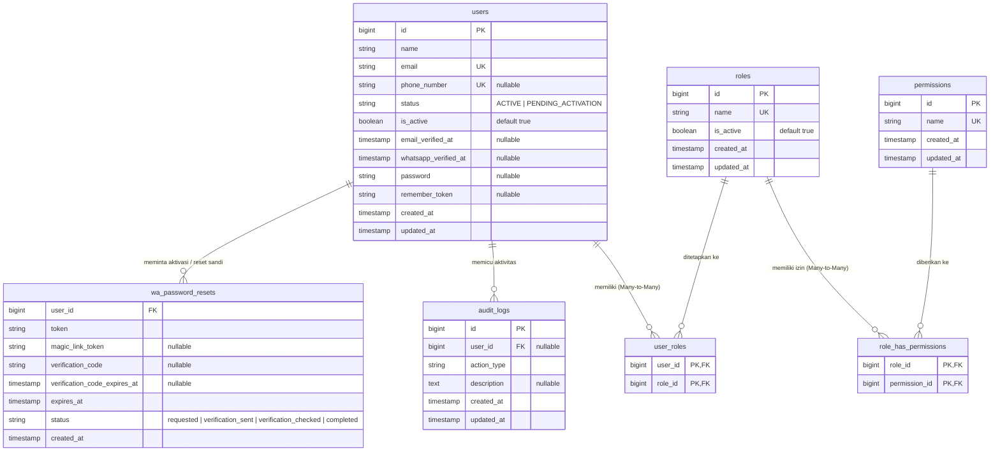

# Panduan Sistem Hak Akses, Database RBAC & Aktivasi Pengguna

## 1. Peran Superuser Sebagai Pengendali Akses Utama

Dalam sistem ini, **Superuser (Bos/Admin Utama)** adalah pemegang kendali penuh atas keamanan dan hak akses seluruh sistem. Superuser bertugas mendaftarkan akun untuk seluruh karyawan, memberikan penugasan peran/jabatan (*Role Assignment*), serta mengatur batasan hak akses yang dimiliki oleh masing-masing jabatan.

## 2. Arsitektur & Skema Basis Data RBAC (Role-Based Access Control)

Sistem KWaS menerapkan skema keamanan berbasis peran (**Role-Based Access Control / RBAC**) yang fleksibel, aman, dan dapat diaudit secara menyeluruh. Skema ini dirancang menggunakan relasi multi-peran (*Many-to-Many*) sehingga satu pengguna dapat merangkap berbagai tugas fungsional di lingkungan operasional pabrik.

### 2.1 Diagram Relasi Entitas (ERD RBAC)

Berikut struktur relasi antar-tabel otorisasi, autentikasi, log audit, dan aktivasi pengguna di dalam basis data:



### 2.2 Spesifikasi Tabel & Kamus Data RBAC

| Nama Tabel | Fungsi & Karakteristik | Kolom Utama & Constraint |
|---|---|---|
| `users` | Menyimpan identitas akun pengguna/karyawan | `id` (PK), `name`, `email` (UK), `phone_number` (UK, nullable), `status` (`ACTIVE`/`PENDING_ACTIVATION`), `is_active` (boolean, default true), `whatsapp_verified_at` (nullable), `password` (nullable, di-hash), `timestamps` |
| `roles` | Daftar jabatan/peran operasional sistem | `id` (PK), `name` (UK), `is_active` (boolean, default true), `timestamps` |
| `permissions` | Butir hak akses operasional granular | `id` (PK), `name` (UK), `timestamps` |
| `user_roles` | Tabel pivot relasi multi-jabatan pengguna | `user_id` (FK → `users.id`, cascade delete), `role_id` (FK → `roles.id`, cascade delete), `PRIMARY KEY (user_id, role_id)` |
| `role_has_permissions` | Tabel pivot relasi paket izin per jabatan | `role_id` (FK → `roles.id`, cascade delete), `permission_id` (FK → `permissions.id`, cascade delete), `PRIMARY KEY (role_id, permission_id)` |
| `audit_logs` | Buku tamu jejak rekam mutasi hak & akun | `id` (PK), `user_id` (FK → `users.id`, set null saat user dihapus), `action_type`, `description`, `timestamps` |
| `wa_password_resets` | Siklus verifikasi WhatsApp & aktivasi mandiri | `user_id` (FK → `users.id`, cascade delete), `token`, `verification_code` (OTP 6 digit), `status`, `expires_at`, `created_at` |

### 2.3 Hak Akses Manajemen Akun & Keamanan (Permission Types)

Untuk menjaga integritas dan tata kelola akun, sistem membatasi wewenang administratif ke dalam hak akses spesifik berikut:

| Nama Hak Akses (*Permission*) | Nilai Enum / Kunci Sistem | Deskripsi Wewenang |
|---|---|---|
| **Kelola Pengguna** | `kelola pengguna` (`ManageUsers`) | Mengakses menu pengguna, mendaftarkan calon karyawan baru, mengubah data profil, serta mengaktifkan/menonaktifkan akun. |
| **Kelola Peran** | `kelola peran` (`ManageRoles`) | Menambah, menyunting, atau menonaktifkan nama jabatan/peran (*Role*) di dalam sistem. |
| **Kelola Akses** | `kelola akses` (`ManagePermissions`) | Menetapkan atau mencabut butir-butir izin (*Permissions*) pada masing-masing peran di tabel `role_has_permissions`. |
| **Lihat Catatan Aktivitas** | `lihat catatan aktivitas` (`ViewAuditLog`) | Membuka dan meninjau seluruh riwayat aktivitas (*audit trail*) terkait perubahan data pengguna, penetapan peran, dan mutasi keamanan sistem. |

### 2.4 Prinsip Kerja Otorisasi (Authorization Engine)

1. **Hak Istimewa Superuser (Superuser Bypass):**
   - Jika pengguna memiliki jabatan `Superuser`, fungsi otorisasi (`hasPermission()`) otomatis mengembalikan nilai `true`. Superuser memegang kendali penuh atas seluruh fitur dan modul tanpa perlu pemetaan izin satu per satu secara manual.
2. **Penggabungan Izin Multi-Role (Union Permissions):**
   - Karyawan yang mengemban lebih dari satu jabatan otomatis memperoleh **akumulasi/gabungan (union)** dari seluruh hak akses yang terdaftar pada setiap peran yang diembannya.
3. **Pemisahan Lapisan Otoritas dan Lapisan Data Transaksi:**
   - Hak akses `permissions` mengontrol siapa yang berhak mengakses fungsi administratif dan operasional (lapisan aplikasi).
   - Perubahan konfigurasi nama izin di kemudian hari tidak akan merusak arsip data historis maupun catatan audit yang telah tercatat sebelumnya.

## 3. Konsep & Alur Aktivasi Calon Pengguna (Onboarding via WhatsApp)

Untuk menjaga keamanan tingkat tinggi dan mencegah kebocoran kata sandi di lingkungan operasional/pabrik, sistem menggunakan mekanisme **Aktivasi Mandiri Terverifikasi** melalui integrasi WhatsApp Gateway (OpenWA). Superuser tidak perlu membuatkan password manual yang rawan bocor atau dibagikan sembarangan.

### A. Status Akun (Life Cycle Karyawan)

Berdasarkan arsitektur data sistem (*data flow*), akun karyawan melewati siklus status berikut:

1. **Calon Pengguna (`PENDING_ACTIVATION`):** Akun telah didaftarkan oleh Superuser dengan data Nama, Email, Nomor WhatsApp, dan Peran (Role), namun kolom kata sandi sengaja dikosongkan. Pada status ini, akun belum dapat login ke dalam sistem.
2. **Pengguna Aktif (`ACTIVE`):** Akun telah menyelesaikan proses aktivasi mandiri via WhatsApp, berhasil memverifikasi kode OTP 6-digit, dan telah menentukan kata sandi pribadinya sendiri.
3. **Kendali Keaktifan (`is_active`):** Sakelar status operasional. Jika karyawan cuti panjang atau nonaktif, Superuser cukup menonaktifkan sakelar `is_active` tanpa perlu menghapus riwayat akun dan transaksi terkait.

### B. Tahapan Alur Aktivasi (Step-by-Step Data Flow)

```
[Superuser]
   │
   ▼ 1. Input Profil (Nama, Email, No. WA) & Role (Password Dikosongkan)
[Database: status = PENDING_ACTIVATION]
   │
   ▼ 2. Calon User Mengakses /aktivasi atau Mengirim Pesan ke Bot WA
[WhatsApp Gateway / OpenWA Microservice]
   │
   ▼ 3. Sistem Cocokkan No. WA & Kirim Magic Link (Masa Berlaku 15 Menit)
[Calon User Membuka Magic Link]
   │
   ▼ 4. Sistem Kirim Kode OTP 6-Digit ke WhatsApp (Masa Berlaku 5 Menit)
[Calon User Memasukkan OTP di Layar Web]
   │
   ▼ 5. Validasi Sukses -> Calon User Mengatur Kata Sandi Baru
[Database: status = ACTIVE, whatsapp_verified_at = now()]
   │
   ▼ 6. Bot WA Kirim Notifikasi Akun Siap Digunakan
[Karyawan Login & Mengakses Sistem Sesuai Wewenang Jabatannya]
```

Rincian langkah operasionalnya:

1. **Pendaftaran Calon Pengguna oleh Superuser:**
   - Superuser masuk ke menu **Kelola Pengguna > Tambah Pengguna**.
   - Mengisi Nama Lengkap, Email Kantor/Pribadi, dan **Nomor WhatsApp aktif**.
   - Memilih penugasan peran/jabatan (*Role Assignment*).
   - **Kata sandi dikosongkan.** Sistem secara otomatis menandai akun sebagai calon pengguna dengan status `PENDING_ACTIVATION`.
2. **Permintaan Aktivasi Mandiri:**
   - Calon karyawan membuka tautan aplikasi dan memilih menu **Aktivasi Akun** (`/aktivasi`) atau langsung mengirim pesan WhatsApp ke nomor resmi Bot KWaS.
   - Pesan yang dikirimkan berisi permintaan aktivasi (misalnya: *"Saya meminta untuk reset sandi dengan nomor 08..."* atau mengirim kata kunci `AKTIVASI`).
3. **Penerbitan Magic Link:**
   - Server mencocokkan nomor pengirim dengan data `users.phone_number` di basis data (baik format lokal `08...` maupun internasional `628...`).
   - Jika cocok, sistem mencatat token permintaan pada entitas `wa_password_resets` dan mengirimkan *Magic Link* aktivasi ke WhatsApp calon user (berlaku selama 15 menit).
4. **Verifikasi Dua Langkah (Kode OTP 6-Digit):**
   - Saat calon user membuka tautan tersebut di peramban, sistem memicu pengiriman kode verifikasi 6 digit ke nomor WhatsApp bersangkutan (berlaku selama 5 menit).
   - Calon user memasukkan kode 6 digit tersebut ke layar peramban untuk membuktikan kepemilikan nomor WhatsApp secara sah.
5. **Penetapan Kata Sandi & Pengaktifan Akun:**
   - Setelah kode diverifikasi, calon user mengetikkan kata sandi baru pilihannya sendiri dan mengonfirmasinya.
   - Sistem mengenkripsi kata sandi (*hash*), memperbarui status akun menjadi `ACTIVE`, serta mencatat waktu verifikasi (`whatsapp_verified_at = now()`).
   - Bot WhatsApp mengirimkan notifikasi konfirmasi bahwa akun telah siap digunakan.
6. **Siap Digunakan:**
   - Karyawan langsung dapat login ke sistem menggunakan Email atau No. WhatsApp beserta sandi barunya, dan mendapatkan akses sesuai wewenang peran yang telah ditetapkan.

## 4. Aturan Main Aplikasi

Agar sistem ini aman dan tertib, berlaku aturan ketat berikut:

1.  **Pendaftaran Terpusat oleh Superuser (Tidak Ada Registrasi Mandiri Liar):** Karyawan **tidak bisa** mendaftarkan akunnya sendiri secara bebas. Pendaftaran data awal, penentuan nomor WhatsApp terdaftar, dan pemberian jabatan mutlak dikontrol oleh Superuser. Namun, penentuan kata sandi dilakukan mandiri oleh calon karyawan melalui aktivasi WhatsApp demi menjaga kerahasiaan.
2.  **Satu Orang Banyak Tugas (Rangkap Jabatan):** Kalau ada karyawan yang kerjanya merangkap (misal: urus Gudang sekaligus Logistik), Superuser bisa mencampurkan hak aksesnya via tabel `user_roles`. Sistem akan otomatis menggabungkan seluruh izin dari peran-peran tersebut.
3.  **Perubahan Hak Akses Real-Time:** Kalau hari ini Superuser memindahkan seorang karyawan dari divisi "Gudang" ke "Logistik", maka saat itu juga wewenang akses karyawan tersebut otomatis berubah menyesuaikan tugas barunya tanpa perlu membuat akun baru.
4.  **Tercatat Seperti Buku Tamu (Audit Log):** Setiap kali Superuser membuat akun baru, mengubah jabatan, atau menggeser hak akses pengguna, sistem otomatis mencatat kejadian tersebut pada tabel `audit_logs` (siapa yang mengubah, kapan, dan apa yang diubah) supaya semuanya transparan dan aman.
5.  **Jabatan Tidak Bisa Dihapus Sembarangan:** Kalau sebuah jabatan sedang aktif dipakai oleh seorang karyawan di tabel `user_roles`, Superuser tidak bisa sembarangan menghapus data jabatan tersebut dari sistem agar sistem tidak error. Jabatan hanya bisa dinonaktifkan (`is_active = false`).
