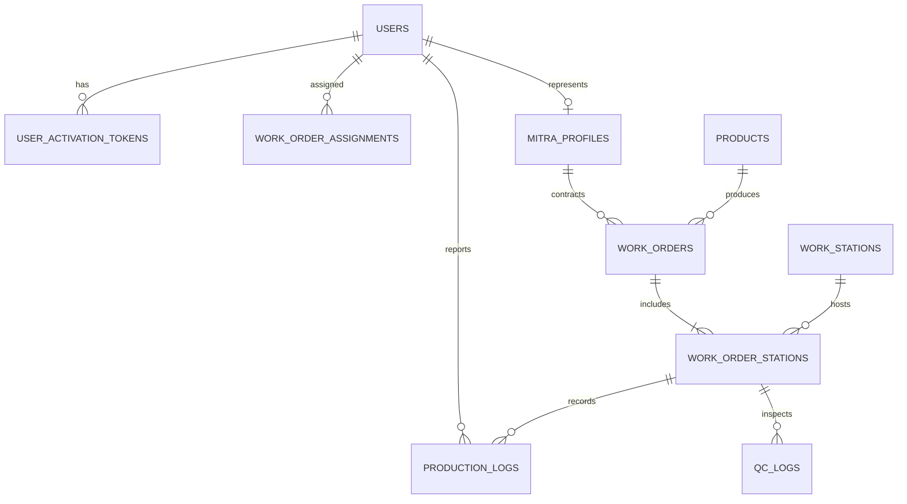

# Blueprint & Dokumen Konsep Sistem Informasi Manajemen Produksi (SIM-Produksi)
## Studi Kasus: Industri Kayu Kitchenware (Kayu KWAS)

---

## 1. Pendahuluan & Latar Belakang

### 1.1 Profil Industri & Latar Belakang
Industri manufaktur peralatan dapur berbahan kayu (*wooden kitchenware*)—seperti talenan (*cutting board*), mangkuk bubut, sendok/spatula kayu, piring saji (*serving platter*), dan tatakan gelas—memiliki karakteristik proses produksi yang unik:
- **Variabilitas Bahan Alami**: Kayu memiliki serat, kadar air (*moisture content*), mata kayu (*knots*), dan potensi melengkung (*warping*) atau retak (*hairline cracks*).
- **Kombinasi Produksi In-House & Mitra (Subkontraktor)**: Kapasitas mesin dan pengrajin lokal sering dimanfaatkan untuk proses awal hingga menengah (seperti pembelahan, pembubutan kasar, pengamplasan awal), sementara perlakuan akhir, kontrol kualitas higienitas (*food-grade finishing*), dan *packaging* dikerjakan terpusat di pabrik utama.
- **Tantangan Pelaporan Konvensional**: Catatan kertas SPK (*Surat Perintah Kerja*) sering tercecer, kotor terkena serbuk kayu atau cairan *finishing*, lambat direkap, dan status pengerjaan mitra di luar pabrik sulit terpantau secara *real-time*.

### 1.2 Tujuan Sistem
1. **Digitalisasi Instruksi Kerja (SPK)**: Memberikan perintah kerja terperinci ke karyawan pabrik maupun mitra eksternal secara terstruktur melalui WhatsApp dan Web Dashboard.
2. **Pelaporan Terdistribusi & Real-Time**: Memudahkan mandor, operator, dan mitra melaporkan kemajuan pengerjaan (jumlah selesai, barang cacat/reject, dan bahan baku terpakai).
3. **Pemberdayaan Saluran WhatsApp Aman (Anti-Spam/Anti-Banned)**: Mengintegrasikan WhatsApp Gateway dengan protokol *"Cold Bonding"* (aktivasi terarah di mana pengguna wajib menginisiasi pesan pertama) untuk menjaga reputasi nomor pengirim.
4. **Keamanan & Tata Kelola Berbasis Peran (RBAC)**: Menjamin pemisahan hak akses antara Superadmin, Manajemen Produksi (PPIC), Pengawas Lapangan (Mandor), QC, Petugas Gudang, serta Akun Terbatas untuk Mitra Produksi.

---

## 2. Arsitektur Routing Stasiun Kerja (5 Stasiun Produksi)

Alur produksi kitchenware kayu distandarisasi ke dalam **5 Stasiun Kerja Utama (Routing Stations)**:

```
[Bahan Baku Balok/Papan]
         │
         ▼
 ┌───────────────────────────┐
 │ 1. Wood Working           │  ◄── In-house / Mitra (Bengkel Kayu)
 └─────────────┬─────────────┘
               │
               ▼
 ┌───────────────────────────┐
 │ 2. Pasca Wood Working     │  ◄── In-house / Mitra (Pengrajin Amplas & Assembly)
 └─────────────┬─────────────┘
               │
               ▼
 ┌───────────────────────────┐
 │ 3. Finishing              │  ◄── In-house / Mitra (Spesialis Finishing)
 └─────────────┬─────────────┘
               │
               ▼
 ┌───────────────────────────┐
 │ 4. Pasca Finishing        │  ◄── In-house (Pabrik Utama)
 └─────────────┬─────────────┘
               │
               ▼
 ┌───────────────────────────┐
 │ 5. Packing                │  ◄── In-house (Pabrik Utama)
 └─────────────┬─────────────┘
               │
               ▼
   [Gudang Produk Jadi (FG)]
```

### 2.1 Detail Operasional Setiap Stasiun

| No | Stasiun Kerja | Aktivitas Utama | Masukan (Input) | Luaran (Output) | Pelaksana Dominan |
|:--:|:---|:---|:---|:---|:---|
| **1** | **Wood Working** | Pemotongan kasar (*cross-cut/rip-cut*), penyerutan (*planer/jointer*), laminasi lem (bila talenan sambung), pembentukan profil (*CNC/Spindle/Scroll saw/Bubut*), pelubangan (*drilling*). | Kayu gelondongan / papan kering oven (*kiln-dried timber*). | Bentuk kasar kayu (*rough-shaped blanks* / bentuk dasar produk). | **In-house / Mitra** |
| **2** | **Pasca Wood Working** | Pengamplasan bertingkat (Grit 80/120/180/240), penambalan pori non-struktural (*food-safe wood filler* jika diizinkan), penumpulan tepi (*chamfer/roundover*), QC dimensi awal. | Komponen kayu berprofil kasar. | Produk kayu halus mentah (*pre-finished smooth surface*). | **In-house / Mitra** |
| **3** | **Finishing** | Aplikasi pelapis makanan (*Food-Grade Finishing*): *mineral oil bath*, *beeswax polish*, atau *food-safe polyurethane / water-based lacquer*, pengeringan/curing. | Produk kayu halus mentah. | Produk kayu terlapisi (*coated/cured product*). | **In-house / Mitra** |
| **4** | **Pasca Finishing** | *Buffing* halus, pembersihan residu minyak/cairan, pengetesan kekeringan lapisan, pemasangan aksesoris (tali kulit, sekrup gantung), ukir logo merek (*laser engraving branding*), QC ketat 100%. | Produk kayu terlapisi kering. | Produk dapur siap kemas (*inspected finished kitchenware*). | **In-House (Wajib Pabrik Utama)** |
| **5** | **Packing** | Pembungkusan anti-lembab (kertas minyak / *greaseproof paper*, *silica gel*), pelabelan barcode/SKU, pembungkusan *bubble/box duplex*, *master carton packing*. | Produk dapur lulus QC akhir. | Kardus kemas siap kirim / simpan di Gudang Barang Jadi (FG). | **In-House (Wajib Pabrik Utama)** |

### 2.2 Regulasi Operasional Mitra (Subkontraktor)
- **Stasiun 1 s.d. 3 (Fleksibel: In-house atau Mitra)**:
  - Pekerjaan yang membutuhkan banyak tenaga manual dan waktu pengerjaan panjang (seperti amplas halus atau pembubutan dalam jumlah besar) dapat didelegasikan ke Mitra Produksi.
  - Setiap pendelegasian ke Mitra wajib disertai **Surat Jalan Bahan Baku Keluar (SJ-Out)** dan nomor **SPK-Mitra**.
- **Stasiun 4 & 5 (Eksklusif In-house)**:
  - Pasca-finishing (inspeksi standar mutu pangan dan grafir logo merk) serta *packing* tidak diizinkan diserahkan ke mitra luar demi menjaga integritas standar mutu (*QC Gatekeeper*) dan menghindari kebocoran kemasan/label merek.

---

## 3. Desain Manajemen Akses Pengguna (RBAC)

Sistem menggunakan **Role-Based Access Control (RBAC)** berjenjang untuk memastikan keamanan data operasional, harga borongan, dan rekam jejak kerja:

```
                  ┌──────────────────────┐
                  │      SUPERADMIN      │
                  └──────────┬───────────┘
                             │
       ┌─────────────────────┼─────────────────────┐
       ▼                     ▼                     ▼
┌──────────────┐      ┌──────────────┐      ┌──────────────┐
│  PPIC / PROD │      │   SUPERVISOR │      │ QC INSPECTOR │
│   MANAGER    │      │   / MANDOR   │      │              │
└──────┬───────┘      └──────┬───────┘      └──────┬───────┘
       │                     │                     │
       └──────────────┬──────┴─────────────────────┘
                      │
       ┌──────────────┴──────────────┐
       ▼                             ▼
┌──────────────┐              ┌──────────────┐
│   OPERATOR   │              │    MITRA     │
│   INTERNAL   │              │   PRODUKSI   │
└──────────────┘              └──────────────┘
```

### 3.1 Rincian Hak Akses (Matrix Permissions)

| Role | Deskripsi & Tanggung Jawab | Hak Akses Dashboard Web | Hak Akses WhatsApp Bot |
|:---|:---|:---|:---|
| **Superadmin** | Pemilik bisnis / Direktur Operasional. Akses tak terbatas. | Konfigurasi sistem, audit log, kelola user & role, setting tarif borongan mitra, approval darurat. | Notifikasi ringkasan harian (*executive summary*), alert kritis (*high defect rate*, keterlambatan fatal). |
| **PPIC / Production Manager** | Pembuat jadwal, perencana kebutuhan bahan, dan penerbit SPK. | Buat/Edit SPK, atur alokasi stasiun (in-house vs mitra), monitoring progres Gantt Chart, terbitkan Surat Jalan Bahan. | Menerima laporan keterlambatan, konfirmasi approval perubahan alur. |
| **Supervisor / Mandor** | Penanggung jawab stasiun pabrik harian. | Cek status antrian stasiun, verifikasi hasil lapor operator, relokasi beban kerja antar operator. | Notifikasi batch masuk stasiun, validasi input operator cepat via reply chat. |
| **QC Inspector** | Pemeriksa kualitas di stasiun 2 (Pasca Wood Working) dan stasiun 4 (Pasca Finishing). | Input form hasil inspeksi (Qty Pass, Qty Reject, Qty Rework, Jenis Defect). | Kirim hasil evaluasi QC instan ke stasiun terkait dan manajer. |
| **Operator Internal** | Pekerja lapangan di stasiun 1, 2, 3, 4, 5. | Akses terbatas via Web Mobile (Opsional) untuk melihat tugas harian. | **Utama**: Menerima penugasan SPK harian, lapor mulai kerja, lapor jumlah selesai & reject. |
| **Mitra Produksi** | Pemilik bengkel / pengrajin mitra rekanan (Stasiun 1-3). | Portal Mitra terbatas (hanya melihat order yang ditugaskan ke dirinya, tagihan borongan, dan surat jalan). | Menerima SPK Borongan, lapor progres berkala per batch, konfirmasi kesiapan kirim balik barang. |
| **Gudang / Logistik** | Pengelola serah terima bahan baku, barang setengah jadi (*WIP*), dan produk jadi. | Catat barang keluar ke mitra, catat barang masuk dari mitra, serah terima ke stasiun packing. | Notifikasi kedatangan barang dari mitra, verifikasi resi surat jalan. |

---

## 4. WhatsApp Integration & Protokol Aktivasi "Cold Bonding" (Anti-Ban Engine)

### 4.1 Latar Belakang Masalah Anti-Spam WhatsApp
WhatsApp memiliki algoritma deteksi perilaku bot dan spam yang sangat agresif:
- Nomor sistem yang mengirim pesan *outbound* pertama kali ke nomor pengguna baru tanpa adanya interaksi balasan berisiko tinggi dilaporkan (*Report as Spam*) atau diblokir otomatis oleh WhatsApp Trust & Safety.
- Untuk mencegah hal ini, **kebijakan arsitektur sistem mewajibkan pola "User-Initiated First Contact"** atau **"Cold Bonding Handshake"**.

### 4.2 Protokol 4-Langkah "Cold Bonding"

```
[1. Registrasi Akun di Sistem]
   Admin daftarkan nama & nomor WA Karyawan/Mitra
   Status Akun: PENDING_ACTIVATION
                 │
                 ▼
[2. Penyerahan Tautan / QR Aktivasi]
   Pengguna menerima Deep-Link (wa.me) atau scan QR Code
   Format: "AKTIFKAN <KODE_TOKEN_UNIK>"
                 │
                 ▼
[3. Pengguna Kirim Pesan Pertama (Cold Bonding)]
   Pengguna mengirim pesan dari HP pribadinya ke nomor WA Bot
                 │
                 ▼
[4. Webhook Verifikasi & Sambutan]
   - Webhook validasi kecocokan token & nomor
   - Status Akun berubah: ACTIVE & BONDED
   - Bot mengirim vCard kontak + instruksi simpan nomor
```

#### Langkah 1: Registrasi Akun (Sistem Web Admin)
- Admin mendaftarkan calon pengguna dengan atribut: `Nama`, `Nomor WhatsApp (format E.164 / 628xxx)`, `Role`, `Stasiun Spesialisasi`.
- Sistem membuat data pengguna dengan status `PENDING_ACTIVATION` dan membuat token aktivasi acak 6 karakter alfa-numerik (misal: `KW-78X2`).
- Sistem menghasilkan dua media kontak:
  1. **QR Code Fisik**: Dicetak pada papan pengumuman pabrik atau dicetak pada lembar perjanjian kemitraan.
  2. **WhatsApp Deep-Link**: `https://wa.me/6281234567890?text=AKTIFKAN%20KW-78X2`

#### Langkah 2: Pengguna Melakukan Inisiasi (First Touch)
- Pengguna (Karyawan/Mitra) membuka link atau memindai QR code menggunakan aplikasi WhatsApp di smartphone mereka.
- Pesan otomatis terisi: `AKTIFKAN KW-78X2`. Pengguna menekan tombol **Kirim**.

#### Langkah 3: Verifikasi via Webhook Gateway
- Webhook WhatsApp Engine (misal OpenWA) menerima payload pesan masuk (`message.received`).
- Sistem memverifikasi:
  1. Apakah pengirim pesan terdaftar di basis data dengan nomor HP yang sama?
  2. Apakah token `KW-78X2` valid dan belum kedaluwarsa?
- Jika valid:
  - Ubah status pengguna menjadi `ACTIVE_BONDED`.
  - Simpan `wa_chat_id` dan *timestamp bonding*.

#### Langkah 4: Pesan Sambutan & Edukasi Simpan Kontak (*Contact Exchange*)
Sistem langsung membalas:
```text
Halo Budi Santoso (Mitra Stasiun: 1 - Wood Working),

Akun Anda telah TERVERIFIKASI dan terhubung dengan Sistem Produksi Kayu KWAS.

PENTING:
Silakan simpan nomor ini di kontak Anda dengan nama "Sistem Produksi KWAS" agar notifikasi Perintah Kerja (SPK) dan update pembayaran dapat Anda terima tanpa kendala.

Ketik MENU untuk melihat perintah yang tersedia.
```

### 4.3 Kebijakan Pengiriman Pesan (Safe Dispatch Policy)
1. **Aturan Tidak Boleh Outbound ke Unbonded**: Sistem **menolak keras** mengirim notifikasi otomatis apa pun ke nomor pengguna yang berstatus `PENDING_ACTIVATION`.
2. **Pacing & Random Jitter**: Pengiriman notifikasi massal (misal: rilis 10 SPK serentak) menggunakan antrean pesan (*message queue*) dengan jeda acak 3 hingga 8 detik per pesan untuk menghindari pola *burst traffic* mesin.
3. **Opt-Out & Unlink Protection**: Pengguna dapat mengirim `STOP` atau `NONAKTIFKAN` kapan saja jika nomor sudah tidak digunakan atau berganti kepemilikan.

---

## 5. Alur Kerja Operasional: Pemberian Perintah & Pelaporan

### 5.1 Siklus Penerbitan SPK (Work Order Flow)

```
 [PPIC Terbitkan SPK]
          │
          ├─────────────────────────────────────────────┐
          ▼                                             ▼
 [SPK Internal: Stasiun 1-5]                   [SPK Mitra: Stasiun 1-3]
 Notifikasi ke Mandor & Operator Lapangan       - Terbitkan Surat Jalan Bahan (SJ-Out)
                                                - Kirim Notifikasi Detail Order & Target
          │                                             │
          ▼                                             ▼
 [Operator Mulai Kerja]                         [Mitra Konfirmasi Terima Bahan]
 Chat WA: "MULAI <ID_SPK>"                      Chat WA: "TERIMA <ID_SPK>"
          │                                             │
          ▼                                             ▼
 [Pelaporan Progres / Selesai]                  [Mitra Lapor Progres / Kirim Balik]
 Chat WA: "SELESAI <ID_SPK> QTY <N>"            Chat WA: "KIRIM <ID_SPK> QTY <N>"
          │                                             │
          ▼                                             ▼
 [QC Station Check / Mandor Verifikasi]         [QC Masuk di Pabrik (SJ-In Check)]
 Status SPK Stasiun: COMPLETED                  Status SPK Stasiun: COMPLETED
          │                                             │
          └──────────────────────┬──────────────────────┘
                                 │
                                 ▼
                     [Lanjut ke Stasiun Berikutnya]
```

### 5.2 Template Format Komunikasi WhatsApp

#### A. Notifikasi Perintah Kerja Baru (SPK Broadcast ke Mitra/Operator)
```text
📦 *SURAT PERINTAH KERJA (SPK)*
No: *SPK-2026-09-0012*
Tipe: *Mitra Borongan*
Penerima: *CV Kayu Sejahtera (Stasiun 1 - Wood Working)*

Item: *Talenan Kayu Jati End-Grain (TJ-01)*
Target Qty: *200 pcs*
Bahan Baku: *Kayu Jati Grade A (Sudah Terkirim - SJ-2026-0081)*
Tenggat Waktu: *20 September 2026*
Catatan Khusus: *Toleransi tebal 2.2 cm, pastikan motif serat seragam.*

Balas pesan ini dengan:
- *TERIMA SPK-0012* (untuk konfirmasi mulai)
- *KENDALA SPK-0012 [Alasan]* (jika ada kendala bahan)
```

#### B. Pelaporan Selesai & Hasil Sortir Kualitas
Pengguna dapat melapor menggunakan sintaks teks langsung atau menekan link ringkas WebView:
```text
Format Pelaporan:
LAPOR <ID_SPK> <QTY_OK> <QTY_REJECT> [CATATAN]

Contoh Input Pengguna:
LAPOR SPK-0012 195 5 Kayu retak di bagian mata
```

Respon Otomatis Bot:
```text
✅ *Laporan Diterima!*
SPK: *SPK-2026-09-0012*
Stasiun: *1. Wood Working*
Bagus (Pass): *195 pcs*
Cacat (Reject): *5 pcs*
Catatan: *Kayu retak di bagian mata*

Terima kasih. Mandor & QC telah menerima laporan ini untuk diverifikasi sebelum dipindahkan ke Stasiun 2 (Pasca Wood Working).
```

#### C. Menu Interaktif Cepat
Jika pengguna mengirimkan pesan `MENU` atau `STATUS`:
```text
🛠 *MENU OPERATOR PRODUKSI KWAS*
Halo, Ahmad. Tugas aktif Anda:

1. *SPK-0012* : Talenan Jati (Sedang Dikerjakan - Target: 200 pcs)
2. *SPK-0015* : Mangkok Mahoni 15cm (Antrian)

Ketik:
- *PROGRESS SPK-0012* untuk update jumlah pengerjaan hari ini
- *SELESAI SPK-0012* jika pekerjaan stasiun ini sudah tuntas
- *BANTUAN* untuk menghubungi mandor piket
```

---

## 6. Desain Skema Data Relasional (Database Architecture)

Untuk menunjang kebutuhan pelacakan per stasiun dan relasi mitra, dirancang entitas basis data utama berikut:



### 6.1 Rincian Tabel Utama

1. **`users`**:
   - `id`, `name`, `phone_number` (format unik 628xxx), `password_hash`, `role` (`superadmin`, `ppic`, `mandor`, `operator`, `mitra`, `qc`, `gudang`), `status` (`pending_activation`, `active_bonded`, `suspended`), `created_at`.
2. **`user_activation_tokens`**:
   - `id`, `user_id`, `token` (misal: `KW-99A1`), `is_redeemed` (boolean), `expires_at`, `redeemed_at`.
3. **`work_stations`**:
   - `id`, `station_code` (`ST-1` s.d. `ST-5`), `name` (*Wood Working, Pasca Wood Working, Finishing, Pasca Finishing, Packing*), `is_external_allowed` (boolean: True untuk 1-3, False untuk 4-5).
4. **`products`**:
   - `id`, `sku`, `name`, `wood_type` (*Jati, Mahoni, Sonokeling, Akasia*), `dimensions`, `finishing_type` (*Beeswax, Food-grade Oil, Lacquer*).
5. **`work_orders` (SPK)**:
   - `id`, `spk_number`, `product_id`, `total_target_qty`, `priority` (`normal`, `urgent`), `status` (`draft`, `in_progress`, `completed`, `cancelled`), `start_date`, `deadline_date`.
6. **`work_order_stations` (Routing Progress per Stasiun)**:
   - `id`, `work_order_id`, `station_id`, `sequence_order` (1 s.d. 5), `assigned_type` (`internal`, `mitra`), `assigned_user_id` (FK to users), `status` (`pending`, `in_progress`, `qc_wait`, `completed`), `input_qty`, `completed_qty`, `reject_qty`, `rework_qty`.
7. **`production_logs` (Rekam Aktivitas & Chat Reports)**:
   - `id`, `work_order_station_id`, `user_id`, `channel` (`whatsapp`, `web`), `log_type` (`start`, `progress_report`, `finish`, `issue`), `reported_qty_pass`, `reported_qty_reject`, `notes`, `raw_payload`.
8. **`qc_logs` (Pemeriksaan Kualitas)**:
   - `id`, `work_order_station_id`, `inspector_user_id`, `sample_qty`, `pass_qty`, `reject_qty`, `defect_categories` (*Pecah, Jamur, Dimensi Tidak Sesuai, Permukaan Kasar, Lapisan Tidak Rata*), `action_taken` (`accept`, `rework`, `scrap`).
9. **`mitra_shipments` (Surat Jalan Bahan & Produk WIP)**:
   - `id`, `sj_number`, `work_order_station_id`, `direction` (`outbound_to_mitra`, `inbound_to_factory`), `driver_name`, `sent_qty`, `received_qty`, `discrepancy_qty`, `notes`.

---

## 7. Arsitektur Teknis Sistem (System Topology)

```
                     ┌───────────────────────────┐
                     │   PENGGUNA / OPERATOR     │
                     │  (WhatsApp App di HP/WA)  │
                     └─────────────┬─────────────┘
                                   │
                                   ▼
 ┌────────────────────────────────────────────────────────────────────────┐
 │                      WHATSAPP GATEWAY LAYER                            │
 │  - Engine: OpenWA / WA Automate Daemon                                 │
 │  - Fitur: Auto-Reconnect, Multi-Device Session, Webhook Dispatcher     │
 └─────────────────┬───────────────────────────────────▲──────────────────┘
                   │ HTTP Webhook (Signed HMAC-SHA256) │ POST Send Message
                   ▼                                   │
 ┌─────────────────────────────────────────────────────┴──────────────────┐
 │                      APPLICATION BACKEND                               │
 │  - Framework: FastAPI (Python) atau NestJS / Express (Node.js)         │
 │  - Modules:                                                            │
 │    1. WhatsApp Handler & Anti-Ban Cold Bonding Engine                  │
 │    2. Production Router & SPK Dispatcher                               │
 │    3. RBAC & Auth Guard                                                │
 │    4. QC & Defect Tracker                                              │
 │    5. Inventory & WIP Handover Service                                 │
 └─────────────────┬───────────────────────────────────┬──────────────────┘
                   │                                   │
                   ▼                                   ▼
 ┌───────────────────────────────┐   ┌────────────────────────────────────┐
 │       PERSISTENCE LAYER       │   │           FRONTEND LAYER           │
 │  - PostgreSQL (Primary DB)    │   │  - Single Page App / PWA           │
 │  - Redis (Queue, Rate Limit,  │   │  - Dashboard Superadmin & PPIC     │
 │    State Machine Bot)         │   │  - Web Mobile Quick Report         │
 └───────────────────────────────┘   └────────────────────────────────────┘
```

### 7.1 Komponen Kunci
1. **WhatsApp Gateway (OpenWA Daemon)**: Berjalan sebagai service terisolasi yang mengelola koneksi soket WA Web, menghasilkan webhook bertanda tangan (*HMAC-SHA256*), dan menangani pengiriman pesan dengan *rate-limiter*.
2. **Backend Application**: Memvalidasi webhook, memproses pesan teks / kata kunci pelaporan, memicu alur perpindahan stasiun, dan menyimpan audit log.
3. **Frontend Dashboard**: Digunakan oleh Superadmin dan PPIC untuk melihat visualisasi status stasiun (*Kanban Board / Gantt Chart*), mencetak SPK/Surat Jalan ber-barcode, dan memantau persentase reject harian.

---

## 8. Langkah Implementasi Bertahap (Roadmap)

1. **Fase 1: Fondasi Data & RBAC**
   - Setup basis data (User, Role, Stasiun Kerja, Produk Kitchenware).
   - Implementasi modul RBAC dan otentikasi login admin/supervisor.
2. **Fase 2: Integrasi WhatsApp Gateway & Cold Bonding**
   - Integrasi konektor WhatsApp (OpenWA) dengan penanganan webhook aman.
   - Pembuatan logika aktivasi nomor (*first contact user-initiated token validation*).
   - Uji coba simulasi registrasi, pemberian vCard bot, dan penolakan *outbound* sebelum *bonding*.
3. **Fase 3: Modul SPK & Routing 5 Stasiun Kerja**
   - Pembuatan alur kerja penerbitan SPK.
   - Penugasan operator internal untuk stasiun 1-5 dan mitra untuk stasiun 1-3.
   - Format pesan perintah kerja dan perintah pelaporan via chat WhatsApp.
4. **Fase 4: QC Gatekeeper & Verifikasi Mandor**
   - Pencatatan defect di Stasiun 2 (Pasca Wood Working) dan Stasiun 4 (Pasca Finishing).
   - Mekanisme *Approval / Reject / Rework* oleh QC Inspector.
5. **Fase 5: Uji Lapangan & Evaluasi Beban (Pilot Test)**
   - Uji coba pada 1 lini produk (misal: Talenan Jati) dengan melibatkan 1 mandor in-house dan 1 mitra stasiun 1.
   - Penyesuaian bahasa perintah WhatsApp agar sesuai dengan dialek/kebiasaan tukang kayu lokal.
