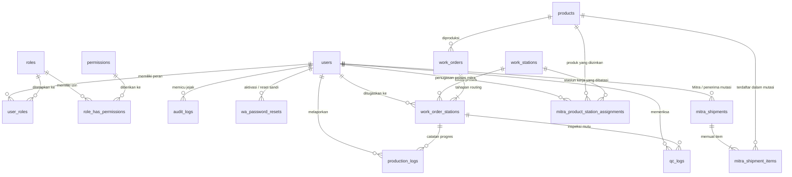

Konsep Sistem Informasi Manajemen Produksi

---

## 1. Pendahuluan & Latar Belakang

### 1.1 Profil Industri & Latar Belakang
Industri manufaktur peralatan dapur berbahan kayu (*wooden kitchenware*) memiliki karakteristik proses produksi yang unik:
- **Variabilitas Bahan Alami**: Kayu memiliki serat, kadar air (*moisture content*), mata kayu (*knots*), dan potensi melengkung (*warping*) atau retak (*hairline cracks*).
- **Kombinasi Produksi In-House & Mitra (Subkontraktor)**: Kapasitas mesin dan pengrajin lokal sering dimanfaatkan untuk proses awal hingga menengah (seperti pembelahan, pembubutan kasar, pengamplasan awal), sementara perlakuan akhir, kontrol kualitas higienitas (*food-grade finishing*), dan *packaging* dikerjakan terpusat di pabrik utama.
- **Tantangan Pelaporan Konvensional**: Catatan kertas SPK (*Surat Perintah Kerja*) sering tercecer, kotor terkena serbuk kayu atau cairan *finishing*, lambat direkap, dan status pengerjaan mitra di luar pabrik sulit terpantau secara *real-time*.

### 1.2 Tujuan Sistem
1. **Digitalisasi Instruksi Kerja (SPK)**: Memberikan perintah kerja terperinci ke karyawan pabrik maupun mitra eksternal secara terstruktur melalui WhatsApp dan Web Dashboard.
2. **Pelaporan Terdistribusi & Real-Time**: Memudahkan mandor, operator, dan mitra melaporkan kemajuan pengerjaan (jumlah selesai, barang cacat/reject, dan bahan baku terpakai).
3. **Pemberdayaan Saluran WhatsApp Aman (Anti-Spam/Anti-Banned)**: Mengintegrasikan WhatsApp Gateway dengan protokol *"Cold Bonding"* (aktivasi terarah di mana pengguna wajib menginisiasi pesan pertama) untuk menjaga reputasi nomor pengirim.
4. **Keamanan & Tata Kelola Berbasis Peran (RBAC)**: Menjamin pemisahan hak akses antara Superadmin, Manajemen Produksi (PPIC), Pengawas Lapangan (Mandor), QC, Petugas Gudang, serta Akun Terbatas untuk Mitra Produksi.

---

## 2. Arsitektur Routing Stasiun Kerja (5 Stasiun Produksi)

Alur produksi kitchenware kayu distandarisasi ke dalam **5 Stasiun Kerja Utama (Routing Stations)**:

```
[Bahan Baku Balok/Papan]
         │
         ▼
 ┌───────────────────────────┐
 │ 1. Wood Working           │  ◄── In-house / Mitra (Bengkel Kayu)
 └─────────────┬─────────────┘
               │
               ▼
 ┌───────────────────────────┐
 │ 2. Pasca Wood Working     │  ◄── In-house / Mitra (Pengrajin Amplas & Assembly)
 └─────────────┬─────────────┘
               │
               ▼
 ┌───────────────────────────┐
 │ 3. Finishing              │  ◄── In-house / Mitra (Spesialis Finishing)
 └─────────────┬─────────────┘
               │
               ▼
 ┌───────────────────────────┐
 │ 4. Pasca Finishing        │  ◄── In-house (Pabrik Utama)
 └─────────────┬─────────────┘
               │
               ▼
 ┌───────────────────────────┐
 │ 5. Packing                │  ◄── In-house (Pabrik Utama)
 └─────────────┬─────────────┘
               │
               ▼
   [Gudang Produk Jadi (FG)]
```

### 2.1 Prinsip Nomenklatur Acuan Kerja: "SPK" untuk Manusia, "Work Order (WO)" untuk Sistem

Untuk menjembatani standar arsitektur perangkat lunak dengan kebiasaan kerja di lantai pabrik dan bengkel mitra, sistem menetapkan aturan pemisahan istilah yang tegas:

```
                      JEMBATAN NOMENKLATUR ACUAN KERJA
                                     │
         ┌───────────────────────────┴───────────────────────────┐
         ▼                                                       ▼
  [SISI SISTEM / BACKEND]                                [SISI MANUSIA / LAPANGAN]
  Istilah: "Work Order" (WO)                            Istilah: "SPK" (Surat Perintah Kerja)
  - Tabel database: work_orders, work_order_stations    - Seluruh pesan WhatsApp ke operator & mitra
  - Kolom relasi: work_order_id, sequence_order         - Format penomoran: No. SPK (misal: SPK-0012)
  - Endpoint API backend & JSON payload                 - Sebutan oleh supir, mandor, QC, & tukang
  - Mengikuti standar internasional manufaktur (MES)    - Membumi, familiar, dan tidak membingungkan
```

1. **Di Sisi Sistem (Database, API, & Kode Program)**:
   - Acuan kerja disimpan dan dikelola sebagai entitas **Work Order (WO)**.
   - Tabel database utama dinamai `work_orders` dan `work_order_stations`.
   - Kode referensi internal menggunakan format `wo_id` (misalnya: `wo_2026_09_0012`).
   - Pendekatan ini menjaga kode backend, API, dan struktur basis data tetap modular sejalan dengan standar internasional sistem manufaktur (ERP/MES).

2. **Di Sisi Manusia (Operator, Tukang Kayu, Mitra, Supir, Mandor, QC)**:
   - Istilah "Work Order" atau singkatan "WO" **tidak pernah dimunculkan ke pengguna**.
   - Seluruh orang lapangan hanya melihat dan mendengar istilah **SPK (Surat Perintah Kerja)** atau **No. SPK** (misal: `SPK-2026-09-0012` atau `SPK 0012`).
   - Di percakapan WhatsApp, nota kerja, label barang, dan obrolan harian, kata yang digunakan selalu **SPK**.

3. **Peran Jembatan Agen AI (Translation Bridge)**:
   - Ketika tukang atau mitra mengetik santai: *"Mas, SPK 0012 talenan jati sampun rampung"*, agen AI otomatis mengenali bahwa `SPK 0012` merujuk ke baris record `work_orders` bersangkutan di database.
   - Saat sistem membalas notifikasi ke nomor WhatsApp, template pesan selalu mencantumkan `No. SPK: SPK-2026-09-0012`.
   - Melalui pemisahan ini, sistem tetap kokoh secara arsitektur teknis data, sementara para pekerja di lapangan merasa nyaman menggunakan istilah lokal yang sudah menjadi budaya kerja mereka sehari-hari.

---

### 2.2 Detail Operasional Setiap Stasiun

| No | Stasiun Kerja | Aktivitas Utama | Masukan (Input) | Luaran (Output) | Pelaksana Dominan |
|:--:|:---|:---|:---|:---|:---|
| **1** | **Wood Working** | Pemotongan kasar (*cross-cut/rip-cut*), penyerutan (*planer/jointer*), laminasi lem (bila talenan sambung), pembentukan profil (*CNC/Spindle/Scroll saw/Bubut*), pelubangan (*drilling*). | Kayu gelondongan / papan kering oven (*kiln-dried timber*). | Bentuk kasar kayu (*rough-shaped blanks* / bentuk dasar produk). | **In-house / Mitra** |
| **2** | **Pasca Wood Working** | Pengamplasan bertingkat (Grit 80/120/180/240), penambalan pori non-struktural (*food-safe wood filler* jika diizinkan), penumpulan tepi (*chamfer/roundover*), QC dimensi awal. | Komponen kayu berprofil kasar. | Produk kayu halus mentah (*pre-finished smooth surface*). | **In-house / Mitra** |
| **3** | **Finishing** | Aplikasi pelapis makanan (*Food-Grade Finishing*): *mineral oil bath*, *beeswax polish*, atau *food-safe polyurethane / water-based lacquer*, pengeringan/curing. | Produk kayu halus mentah. | Produk kayu terlapisi (*coated/cured product*). | **In-house / Mitra** |
| **4** | **Pasca Finishing** | *Buffing* halus, pembersihan residu minyak/cairan, pengetesan kekeringan lapisan, pemasangan aksesoris (tali kulit, sekrup gantung), ukir logo merek (*laser engraving branding*), QC ketat 100%. | Produk kayu terlapisi kering. | Produk dapur siap kemas (*inspected finished kitchenware*). | **In-House (Wajib Pabrik Utama)** |
| **5** | **Packing** | Pembungkusan anti-lembab (kertas minyak / *greaseproof paper*, *silica gel*), pelabelan barcode/SKU, pembungkusan *bubble/box duplex*, *master carton packing*. | Produk dapur lulus QC akhir. | Kardus kemas siap kirim / simpan di Gudang Barang Jadi (FG). | **In-House (Wajib Pabrik Utama)** |

### 2.3 Regulasi Operasional Mitra (Subkontraktor)
- **Stasiun 1 s.d. 3 (Fleksibel: In-house atau Mitra)**:
  - Pekerjaan yang membutuhkan banyak tenaga manual dan waktu pengerjaan panjang (seperti amplas halus atau pembubutan dalam jumlah besar) dapat didelegasikan ke Mitra Produksi.
  - Setiap pendelegasian ke Mitra wajib disertai **Surat Jalan Bahan Baku Keluar (SJ-Out)** dan nomor **SPK-Mitra**.
- **Stasiun 4 & 5 (Eksklusif In-house)**:
  - Pasca-finishing (inspeksi standar mutu pangan dan grafir logo merk) serta *packing* tidak diizinkan diserahkan ke mitra luar demi menjaga integritas standar mutu (*QC Gatekeeper*) dan menghindari kebocoran kemasan/label merek.

### 2.4 Matriks Spesialisasi Produk & Pembatasan Proses per Mitra (Product & Station-Based Contractor Mapping)

#### A. Konsep Master Produk Demo / Prototipe (Katalog Inti Ramping)
Untuk keperluan pembuatan prototipe demo yang aman, cepat, dan teruji, atribut fisik tambahan (seperti dimensi panjang/lebar/tinggi, jenis kayu, dan unit) ditiadakan. Entitas `products` dibatasi secara eksklusif hanya pada:
- **`product_name`**: Nama komersial / sebutan lapangan (e.g. *Telenan Gagang*, *Mangkok Kayu D15/8,5*, *KWAS Curved Spatula KW-T304*).
- **`product_code`**: Nomor / kode SKU unik sistem (e.g. `TLN-GGNG`, `MGK-D1585`, `KW-T304`).

*(Daftar 47 master produk kitchenware kayu dalam format ramping 2 kolom ini telah diarsip dalam seeder [`data/product_masters.csv`](file:///home/ahmad/projects/kwas-tracking-demo/data/product_masters.csv)).*


#### B. Pembatasan Penugasan: Produk Dibatasi pada Proses/Stasiun yang Berlangsung
Di industri kitchenware kayu, **penugasan mitra tidak bersifat mutlak untuk keseluruhan siklus satu barang**, melainkan **terfragmentasi dan dibatasi secara ketat berdasarkan stasiun/proses kerja yang sedang berlangsung (Stasiun 1 s.d. 3)**.

```
 Produk: Telenan Gagang (TLN-GGNG)
                │
                ├─► STASIUN 1 (Wood Working)        ──► MITRA A (Pak Baryadi)
                │   (Belah, serut rata, bentuk profil gagang)
                │
                ├─► STASIUN 2 (Pasca Wood Working)  ──► MITRA D (Pengrajin Amplas)
                │   (Pengamplasan bertingkat Grit 80-240)
                │
                ├─► STASIUN 3 (Finishing)           ──► IN-HOUSE / MITRA SPESIALIS
                │   (Perendaman food-grade mineral oil)
                │
                ├─► STASIUN 4 (Pasca Finishing)     ──► WAJIB IN-HOUSE (Pabrik Utama)
                │   (Buffing, QC akhir 100%, laser logo KWAS)
                │
                └─► STASIUN 5 (Packing)             ──► WAJIB IN-HOUSE (Pabrik Utama)
                    (Bungkus anti-lembab, label barcode)
```

```
 Produk: Mangkok Kayu D15/8,5 (MGK-D1585)
                │
                ├─► STASIUN 1 (Wood Working - Bubut) ──► MITRA B (Pak Sugeng)
                │   (Pembubutan kayu gelondongan jadi mangkok)
                │
                ├─► STASIUN 2 (Pasca Wood Working)   ──► MITRA B (Pak Sugeng)
                │   (Amplas halus mangkok di mesin bubut)
                │
                └─► STASIUN 3 s.d. 5                ──► IN-HOUSE
```

#### C. Karakteristik Aturan Penugasan Produk-Stasiun:
1. **Kombinasi Tiga Dimensi Valid `[Mitra] + [Produk] + [Stasiun]`**:
   Sistem memvalidasi bahwa seorang mitra hanya dapat menerima SPK atau melapor pada stasiun dan produk yang diizinkan di tabel `mitra_product_station_assignments`.
   *Contoh*: Pak Baryadi diizinkan mengerjakan *Telenan Gagang* pada **Stasiun 1**, tetapi dilarang menerima penugasan *Telenan Gagang* untuk **Stasiun 3 (Finishing)** karena bengkel Pak Baryadi tidak memiliki ruang oven pengering finishing standar food-grade.
2. **Kapasitas & Tarif Borongan per Stasiun**:
   Tarif ongkos kerja borongan (*piece rate fee*) dipisahkan per stasiun. Ongkos pengerjaan Stasiun 1 (pembentukan kayu) berbeda dengan ongkos Stasiun 2 (pengamplasan halus).
3. **Penyederhanaan Ekstraksi Agentic AI**:
   Saat Pak Baryadi mengirim chat: *"Mas, telenan gagang beres 100 pcs"*, Agen AI langsung mengetahui dengan pasti bahwa laporan tersebut adalah untuk **Stasiun 1**, tanpa perlu menanyakan stasiun berapa, karena Pak Baryadi memang hanya dipetakan di Stasiun 1 untuk produk tersebut.

### 2.5 Arsitektur & Karakteristik Penugasan In-House (Karyawan Lantai Pabrik)

Penugasan untuk **karyawan in-house (internal pabrik utama)** memiliki karakteristik yang berbeda secara fundamental dengan mitra:

```
                            ┌───────────────────────────────┐
                            │    PPIC / PRODUCTION PLAN     │
                            └───────────────┬───────────────┘
                                            │
               ┌────────────────────────────┴────────────────────────────┐
               ▼                                                         ▼
 ┌───────────────────────────┐                             ┌───────────────────────────┐
 │ PENUGASAN MITRA (EKSTERNAL)│                             │   PENUGASAN IN-HOUSE      │
 ├───────────────────────────┤                             ├───────────────────────────┤
 │ • Stasiun Terbatas: 1 s/d 3│                             │ • Semua Stasiun: 1 s/d 5  │
 │ • Wajib Surat Jalan Logistik│                            │ • Eksklusif di Stasiun 4&5│
 │ • Sistem Upah Borongan/Pcs│                             │ • Gaji Pokok + Insentif   │
 │ • Unit: Bengkel / Workshop│                             │ • Unit: Operator / Palet  │
 └───────────────────────────┘                             └───────────────────────────┘
```

#### A. Matriks Perbandingan In-House vs Mitra

| Parameter | Penugasan Mitra (Subkontraktor) | Penugasan In-House (Karyawan Pabrik) |
|:---|:---|:---|
| **Cakupan Stasiun Kerja** | **Dibatasi Stasiun 1 s.d. 3** | **Bebas di Stasiun 1 s.d. 5** (Wajib 100% In-house pada Stasiun 4 & 5) |
| **Penerima Tugas** | Pemilik workshop mitra (kontak perorangan/CV) | Operator mesin, tim lini kerja, atau Mandor stasiun |
| **Bentuk Kompensasi** | Tarif borongan per pcs produk selesai (*Piece-rate*) | Gaji harian/bulanan + bonus target output shift |
| **Pergerakan Bahan Baku** | Menggunakan armada truk + **Surat Jalan Luar (SJ-Out/SJ-In)** | Antar-stasiun internal menggunakan **Rak Palet WIP** tanpa surat jalan keluar |
| **Perlakuan Stasiun 4 & 5** | **Dilarang keras** (Kerahasiaan kemasan & lisensi logo grafir) | **Eksklusif In-House**: Laser logo grafir KWAS, final QC inspeksi 100%, dan packing barcode |

#### B. Mekanisme Penugasan In-House per Stasiun (1 s.d. 5):
1. **Stasiun 1: Wood Working In-House**:
   - Ditugaskan ke operator mesin pabrik (misal: *Mas Joko - Operator Bubut* untuk Mangkok Mahoni `MGK-D1585`, atau operator serut/CNC).
2. **Stasiun 2: Pasca Wood Working In-House**:
   - Ditugaskan ke tim pengamplasan meja in-house (*grit 80–240*) atau tim penambalan pori kayu alami.
3. **Stasiun 3: Finishing In-House**:
   - Ditugaskan ke operator bak celup *food-grade mineral oil*, perendaman beeswax, dan pengeringan ruang kontrol suhu (*curing room*).
4. **Stasiun 4: Pasca Finishing (Eksklusif In-House)**:
   - Ditugaskan ke **Operator Mesin Laser Engraving** (untuk grafir logo KWAS pada produk seperti *Board + Logo Grafir*, *Plate 24 + Logo Grafir*) dan **Final QC Inspector** (pemeriksaan kehalusan, residu minyak, uji higienitas).
5. **Stasiun 5: Packing (Eksklusif In-House)**:
   - Ditugaskan ke tim kemas: pembungkusan kertas minyak anti-lembab, penempelan stiker barcode SKU, kardus satuan, dan serah terima ke Gudang Barang Jadi (FG).

---

### 2.6 Alur Kontrol Kualitas (QC) di Mitra: Standar Tugas Tunggal (Datang Sendiri atau Bersama Sopir)

Sesuai kebutuhan lapangan, **tugas dan tanggung jawab petugas QC di bengkel mitra tidak dibeda-bedakan**, baik saat QC datang sendiri maupun saat ikut bersama armada supir:

```
                  KONTROL KUALITAS (QC) DI BENGKEL MITRA
                                    │
       ┌────────────────────────────┴────────────────────────────┐
       ▼                                                         ▼
 [IKUT BERSAMA SOPIR]                                      [DATANG SENDIRI]
 Naik mobil bak L300 bareng supir & helper                 Naik sepeda motor dinas operasional
       │                                                         │
       └────────────────────────────┬────────────────────────────┘
                                    │
                                    ▼
       ┌─────────────────────────────────────────────────────────┐
       │             TUGAS PEMERIKSAAN QC SAMA PERSIS            │
       │ 1. Cek Kayu Kering & Bebas Jamur (Pisahkan Revisi Jamur)│
       │ 2. Cek Ukuran & Kecocokan Mal Master (Tebal & Bentuk)   │
       │ 3. Cek Kehalusan Amplas (Bebas Goresan Kasar Pisau)     │
       │ 4. Hitung & Pilah Fisik (Lolos vs Rework di Tempat)     │
       └────────────────────────────┬────────────────────────────┘
                                    │
                                    ▼
       ┌─────────────────────────────────────────────────────────┐
       │                LAPOR LANGSUNG VIA WHATSAPP              │
       │ - Saat jemput barang : Lapor jumlah & revisi jamur      │
       │ - Saat kontrol mampir: Lapor "SPK 0012 AMAN LANJUT"     │
       └─────────────────────────────────────────────────────────┘
```

#### A. Tugas Pemeriksaan QC di Bengkel Mitra (Standar Tunggal)
Di mana pun dan kapan pun QC bertugas di bengkel mitra, hal yang diperiksa selalu meliputi 4 hal praktis berikut:
1. **Cek Keringnya Kayu & Jamur**:
   - Memastikan kayu yang dikerjakan mitra tidak basah/anyep. Kayu basah tidak boleh dipaksakan diserut karena rawan melengkung (*baling*) atau berjamur saat jadi barang.
   - Jika ditemukan bintik jamur putih/lembab, langsung dipisahkan sebagai **"Revisi Jamur"**.
   - *Kebijakan*: Barang revisi jamur tetap dibawa ke pabrik in-house untuk dimasukkan ke fasilitas oven pengering (*kiln dryer*) dan diamplas ulang di pabrik.
2. **Cek Ukuran & Mal Contoh**:
   - Menempelkan benda kerja ke mal master (apakah tebal serut rata, lengkungan gagang presisi, lubang gantungan pas).
3. **Cek Kehalusan Amplas**:
   - Meraba permukaan kayu pakai tangan untuk memastikan goresan pisau serut kasar sudah hilang merata dan amplasan halus sesuai standar.
4. **Hitung & Pilah Kuantitas (Lolos vs 3 Tingkatan Rijek)**:
   Menghitung fisik barang secara transparan bersama mitra dan mengelompokkan ke dalam kategori keputusan:
   - **Lolos (Pass)**: Produk bagus, presisi sesuai mal contoh, kayu kering, amplas halus, langsung siap lanjut ke stasiun berikutnya.
   - **Rijek (Reject)**, dipilah secara adil ke dalam 3 tingkatan penanganan:
     1. **Bisa diperbaiki tidak berubah banyak (Perbaikan Ringan / Minor Rework)**: Cacat permukaan yang bisa dirapikan langsung tanpa merombak bentuk dasar (contoh: amplas ulang sedikit pada bekas serut kasar, serut tipis ulang, bersihkan jamur/noda tipis permukaan).
     2. **Harus bongkar (Perbaikan Berat / Major Rework)**: Cacat konstruksi yang mengharuskan pembongkaran sambungan sebelum dirangkai ulang (contoh: sambungan laminasi papan renggang/lem miring, pasak melenceng, harus dibongkar, dibersihkan lem lamanya, lalu dipress dan dilem ulang).
     3. **Harus ganti (Cacat Fatal / Scrap Replacement)**: Cacat fatal yang tidak dapat diselamatkan (contoh: kayu retak pecah tembus, mata kayu busuk jebol parah, salah potong kependekan sehingga tidak memenuhi ukuran produk apapun). Wajib diafkir (*scrap*) dan diganti dengan potongan bahan baku baru.

---

#### B. Dua Pilihan Moda Kedatangan QC (Hanya Pilihan Transportasi)
Perbedaan di lapangan hanyalah pada **sarana transportasi dan waktu keberangkatan**, bukan pada tugasnya:

1. **Opsi 1: QC Ikut Bersama Sopir (Armada Mobil Bak L300)**:
   - QC berangkat bersama Supir (*Kelik*) dan Helper (*Ridvan*) saat mobil dijadwalkan menjemput barang di bengkel mitra.
   - Di lokasi mitra, QC memeriksa dan memilah tumpukan barang bersama mitra **sebelum dinaikkan ke mobil bak**.
   - Pelaporan di WhatsApp menggunakan format penjemputan ("Pesan Hijau") dengan kata kunci **AMBIL**:
     ```text
     ambil pak baryadi
     total telenan oval 368 pcs
     revisi jamur 148 pcs
     ```

2. **Opsi 2: QC Datang Sendiri (Sepeda Motor Dinas Mandiri)**:
   - QC berangkat sendiri naik sepeda motor operasional pabrik.
   - Cocok saat mobil jemputan belum jalan, saat mitra baru memulai pengerjaan (kontrol awal agar tidak salah massal), atau saat ada panggilan cek mendadak dari mitra.
   - Pengecekan yang dilakukan **persis sama** (cek kayu kering, cek mal contoh, cek amplas, cek kuantitas lolos vs 3 jenis rijek).
   - **Standar Informasi Pelaporan (Sederhana, Lengkap & Jelas)**:
     Pelaporan dari lapangan mencakup informasi penting:
     1. **SPK apa**: Nomor SPK rujukan (e.g. `SPK 0012`)
     2. **Mitranya siapa**: Nama pengrajin/bengkel mitra (e.g. `Pak Baryadi`)
     3. **Produknya apa**: Nama barang yang dikerjakan (e.g. `Telenan Gagang`)
     4. **Kuantitasnya (Lolos & 3 Jenis Rijek)**:
        - Lolos (bagus)
        - Rijek bisa diperbaiki tidak berubah banyak (ringan)
        - Rijek harus bongkar (berat)
        - Rijek harus ganti (fatal/scrap)
     5. **Kondisi produknya apa**: Hasil pemeriksaan fisik (kayu kering, mal presisi, amplas halus)
     6. **Kendalanya apa**: Masalah lapangan jika ada (atau `nihil / aman lanjut`)

   - **Contoh Format Pesan WhatsApp Lapangan**:
     *Format Poin Ringkas (Kuantitas Lengkap):*
     ```text
     Cek QC Lapangan
     SPK       : 0012
     Mitra     : Pak Baryadi
     Produk    : Telenan Gagang
     Kuantitas : Lolos 180 pcs | Rijek: 10 perbaiki ringan, 3 harus bongkar, 2 harus ganti
     Kondisi   : Kayu kering, mal pas, amplas halus
     Kendala   : Nihil kendala bahan, mitra sudah paham perbaikan bongkar
     ```
     *Format Chat Mengalir (Santai Lapangan):*
     ```text
     Cek SPK 0012 Pak Baryadi produk telenan gagang: lolos 180 pcs, rijek 10 bisa diperbaiki ringan amplas, 3 harus bongkar lem, 2 harus ganti kayu pecah. Kondisi kayu kering, ukuran mal pas. Aman lanjut kerja.
     ```
     *Format Jika Ditemukan Kendala Serius:*
     ```text
     Cek QC Lapangan
     SPK       : 0012
     Mitra     : Pak Baryadi
     Produk    : Telenan Gagang
     Kuantitas : Lolos 50 pcs | Rijek: 20 harus bongkar (lem renggang), 15 harus ganti (kayu retak tembus)
     Kondisi   : Mal ukuran gagang pas
     Kendala   : Kayu masih agak anyep dan campuran lem kurang rekat. Pengerjaan dipending sementara untuk evaluasi.
     ```

---

#### C. Aturan Logistik Dua Dimensi: Posisi Kendaraan (Keluar/Masuk) vs Aksi Produk (Ambil/Kirim)

Sistem menetapkan pemisahan tegas antara **situasi/posisi armada kendaraan** dengan **aksi/tindakan terhadap produk** agar tidak terjadi salah sangka di lapangan:

1. **Dimensi Kendaraan: Posisi KELUAR vs MASUK Gerbang Pabrik**
   - **`keluar` (Gate Out)**: Posisi fisik kendaraan/armada mobil saat meninggalkan pos gerbang pabrik menuju luar.
   - **`masuk` (Gate In)**: Posisi fisik kendaraan/armada mobil saat tiba kembali memasuki pos gerbang pabrik.
   *(Dicatat pada manifest resmi / buku satpam pada kolom `Ket: keluar` atau `Ket: masuk` bersama jam gerbang).*

2. **Dimensi Produk: Tindakan AMBIL vs KIRIM Produk**
   - **`KIRIM`**: Aksi operasional mengantar bahan baku (papan potong, balok mentah, lem) dari pabrik ke bengkel mitra untuk dikerjakan.
   - **`AMBIL`**: Aksi operasional menjemput/mengambil hasil olahan kayu dari bengkel mitra untuk dibawa ke pabrik (disertai pemilahan QC: barang lolos vs revisi jamur).
   *(Disebutkan dalam pesan singkat WhatsApp di lapangan, misalnya: `ambil pak baryadi` atau `kirim pak baryadi`).*

```
               MATRIKS KOMBINASI DUA DIMENSI LOGISTIK
                                  │
         ┌────────────────────────┴────────────────────────┐
         ▼                                                 ▼
  [POSISI KENDARAAN: KELUAR GERBANG]        [POSISI KENDARAAN: MASUK GERBANG]
  • Situasi 1: Mobil KELUAR untuk AMBIL     • Situasi 3: Mobil MASUK bawa hasil AMBIL
    - Kendaraan  : keluar (Gate Out)          - Kendaraan  : masuk (Gate In)
    - Aksi Produk: AMBIL (berangkat jemput)   - Aksi Produk: AMBIL (muatan tiba di pabrik)
    - Kondisi    : Menuju bengkel mitra       - Muatan     : Hasil kerja mitra & revisi jamur
                                              
  • Situasi 2: Mobil KELUAR untuk KIRIM     • Situasi 4: Mobil MASUK selesai KIRIM
    - Kendaraan  : keluar (Gate Out)          - Kendaraan  : masuk (Gate In)
    - Aksi Produk: KIRIM (antar bahan)        - Aksi Produk: KIRIM Selesai
    - Kondisi    : Membawa bahan mentah       - Kondisi    : Kembali kosong / drop selesai
```

3. **Pencegahan Salah Sangka oleh Agen AI**:
   - Jika supir atau admin mengetik `ambil pak baryadi`, Agen AI langsung memetakan sebagai **Aksi Produk: AMBIL**. Status kendaraan di gerbang diselaraskan dengan waktu keberangkatan/kepulangan armada (`Ket: keluar` saat berangkat jemput, `Ket: masuk` saat tiba membawa muatan).
   - Jika ada pesan ambigu di WhatsApp (misalnya hanya mengetik: *"Pak Baryadi telenan oval 368"* tanpa kata aksi), Agen AI **tidak menebak**, melainkan bertanya balik untuk memastikan aksi produknya:
     > *"Mohon konfirmasi tindakan terhadap produk:*  
     > *1. KIRIM (Mengantar bahan baku ke Pak Baryadi)*  
     > *2. AMBIL (Menjemput hasil olahan dari Pak Baryadi)*  
     > *(Ketik: KIRIM atau AMBIL)"*

---

#### D. Ringkasan: Tugas Sama, Pelaporan Fleksibel

| Poin Perbandingan | QC Ikut Bersama Sopir | QC Datang Sendiri |
|:---|:---|:---|
| **Tugas QC** | **SAMA**: Cek kayu kering/jamur, kecocokan mal, kehalusan amplas, dan hitung pemilahan barang. | **SAMA**: Cek kayu kering/jamur, kecocokan mal, kehalusan amplas, dan hitung pemilahan barang. |
| **Moda Transportasi** | Mobil bak pabrik L300 (bareng Supir & Helper). | Sepeda motor dinas pabrik (mandiri). |
| **Kapan Dilakukan** | Saat mobil pabrik berangkat jemput barang di mitra. | Fleksibel (bisa saat pengerjaan awal, saat berjalan, atau saat barang siap). |
| **Pelaporan WhatsApp** | Pesan ringkas penjemputan ("Pesan Hijau: AMBIL"). | Chat santai hasil cek ("SPK 0012 aman lanjut"). |
| **Dampak ke Sistem** | Kuantitas lolos & revisi jamur dicatat sebagai barang MASUK. | Status SPK mitra terverifikasi teknis dan diteruskan ke Mandor. |


## 3. Desain Manajemen Akses Pengguna (RBAC) & Tata Kelola Superuser
*(Aturan tata kelola akun mengacu penuh pada dokumen otoritatif: [Panduan Sistem Hak Akses, Database RBAC & Aktivasi Pengguna](konsep-sistem-manajemen-akun))*

Sistem mengadopsi arsitektur **Role-Based Access Control (RBAC)** *Many-to-Many* yang fleksibel dan diaudit menyeluruh untuk lingkungan pabrik:

```
                  ┌───────────────────────┐
                  │       SUPERUSER       │
                  └────────────────────┬──┘
                                       │
       ┌───────────────────────────────┼───────────────────────────────┐
       ▼                               ▼                               ▼
┌──────────────┐                ┌──────────────┐                ┌──────────────┐
│  PPIC / PROD │                │  SUPERVISOR  │                │ QC INSPECTOR │
│   MANAGER    │                │   / MANDOR   │                │              │
└──────┬───────┘                └──────┬───────┘                └──────┬───────┘
       │                               │                               │
       └───────────────────────────────┼───────────────────────────────┘
                                       │ (Dapat Merangkap / Multi-Role)
                        ┌──────────────┴──────────────┐
                        ▼                             ▼
                 ┌──────────────┐              ┌──────────────┐
                 │   OPERATOR   │              │    MITRA     │
                 │   INTERNAL   │              │   PRODUKSI   │
                 └──────────────┘              └──────────────┘
```

### 3.1 Prinsip Kerja Otorisasi & Hak Akses
1. **Hak Istimewa Superuser (*Superuser Bypass*)**: Pengguna dengan peran `Superuser` memiliki bypass otorisasi (`hasPermission() = true`), memegang kontrol penuh atas sistem, manajemen pengguna, penugasan peran, dan konfigurasi tanpa batas.
2. **Dukungan Multi-Role (Rangkap Jabatan)**: Relasi antara `users` dan `roles` bersifat *Many-to-Many* melalui tabel pivot `user_roles`. Karyawan yang merangkap tugas (misal: Mandor sekaligus penanggung jawab Gudang Logistik) memperoleh hak akses gabungan (*Union Permissions*) secara otomatis.
3. **Pemisahan Butir Izin Granular (*Permissions*)**:
   - **Izin Administratif Akun**:
     - `kelola pengguna` (`ManageUsers`)
     - `kelola peran` (`ManageRoles`)
     - `kelola akses` (`ManagePermissions`)
     - `lihat catatan aktivitas` (`ViewAuditLog`)
   - **Izin Operasional Produksi**:
     - `kelola spk` (`ManageWorkOrders`)
     - `kelola stasiun & routing` (`ManageStations`)
     - `verifikasi laporan produksi` (`VerifyProductionLogs`)
     - `input inspeksi qc` (`InputQCInspection`)
     - `kelola mutasi logistik` (`ManageLogistics`)

### 3.2 Matriks Peran & Tanggung Jawab Operasional

| Role (*Jabatan*) | Deskripsi & Tanggung Jawab | Akses Dashboard Web | Akses Saluran WhatsApp |
|:---|:---|:---|:---|
| **Superuser** | Pemilik bisnis / Admin Utama. Akses bypass tak terbatas. | Konfigurasi sistem, audit log, kelola user & role, setting tarif borongan mitra, approval darurat. | Notifikasi ringkasan eksekutif harian, alert anomali kritis. |
| **PPIC / Production Manager** | Perencana jadwal, kebutuhan bahan, dan penerbit SPK. | Buat/Edit SPK, atur alokasi stasiun (in-house vs mitra), monitoring Gantt Chart, terbitkan Surat Jalan Bahan. | Menerima alert keterlambatan dan eskalasi pengerjaan. |
| **Supervisor / Mandor** | Penanggung jawab stasiun harian di lantai pabrik. | Monitoring antrian stasiun, verifikasi hasil lapor operator, relokasi beban kerja antar operator. | Notifikasi batch masuk stasiun, validasi cepat via chat. |
| **QC Inspector** | Pemeriksa kualitas di Stasiun 2 (Pasca Wood Working), Stasiun 4 (Pasca Finishing), dan pintu masuk logistik (*Incoming QC*). | Input form hasil inspeksi (Qty Pass, Qty Reject, Qty Rework, Defect categories). | Menerima hasil parsing otomatis temuan defect (misal: Revisi Jamur). |
| **Operator Internal** | Pekerja lapangan di Stasiun 1–5. | Akses Web Mobile terbatas (opsional) untuk melihat antrian tugas. | **Utama**: Menerima SPK, lapor mulai kerja, lapor progres/selesai via chat santai / voice note / foto. |
| **Mitra Produksi** | Pemilik workshop / pengrajin mitra rekanan (Stasiun 1–3). | Portal Mitra terbatas (melihat pesanan yang dialokasikan ke dirinya, surat jalan, dan tagihan borongan). | Menerima SPK Borongan, lapor progres berkala, konfirmasi kesiapan kirim/ambil barang. |
| **Gudang / Logistik** | Pengelola serah terima bahan baku, barang setengah jadi (*WIP*), dan armada. | Catat mutasi barang keluar/masuk, verifikasi resi surat jalan, kontrol supir & helper. | Terima notifikasi data keluar/masuk barang, forward pesan mutasi logistik. |

---

## 4. WhatsApp Integration & Protokol Aktivasi Akun Mandiri ("Cold Bonding")
*(Mengikuti alur resmi `konsep-sistem-manajemen-akun`)*

### 4.1 Latar Belakang Masalah Anti-Spam & Keamanan Kata Sandi
WhatsApp melarang keras pengiriman pesan otomatis pertama kali (*outbound cold messaging*) ke nomor yang belum berinteraksi atau belum menyimpan nomor bot sistem:
1. **Pencegahan Banned Nomor (Anti-Spam WhatsApp)**: Pengguna wajib menginisiasi percakapan pertama (*User-Initiated First Contact / Cold Bonding*).
2. **Kerahasiaan Kata Sandi Lapangan**: Superuser tidak boleh membuatkan password manual yang rawan disalahgunakan atau dicatat sembarangan. Kata sandi ditetapkan sendiri oleh calon pengguna melalui proses verifikasi dua langkah.

### 4.2 Alur 6-Langkah Aktivasi Mandiri & Cold Bonding (Data Flow)

```
[Superuser / Admin Utama]
   │
   ▼ 1. Input Profil (Nama, Email, No. WA) & Role (Password Dikosongkan)
[Database: users.status = PENDING_ACTIVATION]
   │
   ▼ 2. Calon Pengguna Kirim Pesan Pertama / Buka /aktivasi (Cold Bonding)
[WhatsApp Gateway / OpenWA Webhook]
   │
   ▼ 3. Server Verifikasi No. WA ──► Kirim Magic Link (Berlaku 15 Menit)
[Calon Pengguna Membuka Magic Link di Browser]
   │
   ▼ 4. Server Kirim OTP 6-Digit via WhatsApp (Berlaku 5 Menit)
[Calon Pengguna Memasukkan OTP di Layar Web]
   │
   ▼ 5. Validasi Sukses ──► Calon Pengguna Mengatur Kata Sandi Baru
[Database: status = ACTIVE, whatsapp_verified_at = now()]
   │
   ▼ 6. Bot WhatsApp Kirim Sambutan & Edukasi Simpan Kontak (Contact Card)
[Karyawan/Mitra Siap Menerima Tugas & Berinteraksi dengan Sistem]
```

#### Rincian Langkah Operasional:
1. **Pendaftaran Terpusat oleh Superuser**:
   - Superuser mendaftarkan Nama Lengkap, Email, dan **Nomor WhatsApp aktif** (format `08...` atau `628...`), serta memilih penugasan peran (*user_roles*).
   - **Kolom kata sandi dikosongkan (`password = null`)**. Status akun diset `PENDING_ACTIVATION`.
2. **Inisiasi Kontak Pertama (Cold Bonding Handshake)**:
   - Calon pengguna mengakses menu `/aktivasi` di web atau langsung mengirimkan pesan WhatsApp ke nomor bot resmi KWaS (misalnya mengetik: *"Saya meminta untuk reset sandi dengan nomor 08..."* atau kata kunci `AKTIVASI`).
   - Pesan pertama ini secara otomatis membentuk interaksi dua arah di mata algoritma WhatsApp.
3. **Penerbitan Magic Link Terverifikasi**:
   - Sistem mencocokkan nomor WhatsApp pengirim dengan data `users.phone_number`.
   - Jika cocok, sistem mencatat entitas baru di tabel `wa_password_resets` dan mengirimkan tautan *Magic Link* ke WhatsApp pengguna (berlaku selama 15 menit).
4. **Verifikasi Dua Langkah (Kode OTP 6-Digit)**:
   - Saat calon pengguna membuka Magic Link di peramban, sistem memicu pengiriman kode verifikasi OTP 6 digit ke nomor WhatsApp bersangkutan (berlaku selama 5 menit).
   - Pengguna memasukkan kode OTP ke halaman web untuk memvalidasi kepemilikan nomor.
5. **Penetapan Kata Sandi Pribadi & Pengaktifan Akun**:
   - Setelah OTP valid, pengguna mengetikkan kata sandi baru pilihannya sendiri.
   - Sistem mengenkripsi (*hash*) kata sandi, mengubah `users.status` menjadi `ACTIVE`, mencatat `whatsapp_verified_at = now()`, dan mencatat riwayat perubahan di tabel `audit_logs`.
6. **Penyimpanan Kontak & Pesan Sambutan**:
   - Bot WhatsApp mengirimkan kartu kontak (vCard) resmi:
     ```text
     Halo Budi Santoso (Mitra Stasiun: 1 - Wood Working),

     Akun Anda telah TERVERIFIKASI dan aktif.

     PENTING:
     Silakan simpan kontak nomor ini dengan nama "Sistem Produksi KWAS" agar notifikasi Perintah Kerja (SPK) dan koordinasi logistik masuk tanpa kendala.

     Ketik MENU untuk melihat daftar perintah.
     ```

### 4.3 Kebijakan Pengiriman Pesan (Safe Dispatch Policy)
1. **Aturan Blokir Outbound ke Unbonded/Unverified**: Sistem **menolak keras** mengirim notifikasi otomatis (SPK/surat jalan) ke nomor pengguna yang berstatus `PENDING_ACTIVATION` atau `whatsapp_verified_at IS NULL`.
2. **Pacing & Random Jitter**: Pengiriman notifikasi massal dijadwalkan dengan antrean (*message queue*) dengan jeda acak 3 hingga 8 detik per pesan.
3. **Kendali Sakelar Keaktifan (`is_active`)**: Jika seorang karyawan atau mitra berhenti bekerja sama, Superuser cukup menonaktifkan sakelar `is_active = false` tanpa merusak riwayat transaksi SPK masa lalu.


---

## 5. Alur Kerja Operasional: Pemberian Perintah & Pelaporan

### 5.1 Siklus Penerbitan SPK (Work Order Flow)

```
 [PPIC Terbitkan SPK]
          │
          ├─────────────────────────────────────────────┐
          ▼                                             ▼
 [SPK Internal: Stasiun 1-5]                   [SPK Mitra: Stasiun 1-3]
 Notifikasi ke Mandor & Operator Lapangan       - Terbitkan Surat Jalan Bahan (SJ-Out)
                                                - Kirim Notifikasi Detail Order & Target
          │                                             │
          ▼                                             ▼
 [Operator Mulai Kerja]                         [Mitra Konfirmasi Terima Bahan]
 Chat WA: "MULAI <ID_SPK>"                      Chat WA: "TERIMA <ID_SPK>"
          │                                             │
          ▼                                             ▼
 [Pelaporan Progres / Selesai]                  [Mitra Lapor Progres / Kirim Balik]
 Chat WA: "SELESAI <ID_SPK> QTY <N>"            Chat WA: "KIRIM <ID_SPK> QTY <N>"
          │                                             │
          ▼                                             ▼
 [QC Station Check / Mandor Verifikasi]         [QC Masuk di Pabrik (SJ-In Check)]
 Status SPK Stasiun: COMPLETED                  Status SPK Stasiun: COMPLETED
          │                                             │
          └──────────────────────┬──────────────────────┘
                                 │
                                 ▼
                     [Lanjut ke Stasiun Berikutnya]
```

### 5.2 Pustaka Template Komunikasi WhatsApp Standar
Seluruh interaksi operasional antara sistem, staf internal, dan mitra diformulasikan ke dalam 3 kelompok template pesan terstandarisasi:

---

#### KELOMPOK 1: TEMPLATE NOTIFIKASI PENUGASAN (TASK ASSIGNMENT)

##### Template 1.1: Notifikasi Penugasan SPK ke Mitra (Dibatasi Stasiun 1–3)
Diterbitkan otomatis saat PPIC merilis alokasi SPK ke bengkel mitra:
```text
[SURAT PERINTAH KERJA (SPK) MITRA]
No. SPK      : *SPK-2026-09-0012*
Penerima     : *Pak Baryadi (Mitra A)*
Tanggal Rilis: 15-09-2026 | Deadline: *20-09-2026*

[DETAIL PEKERJAAN]
Produk       : *Telenan Gagang*
Kode SKU     : *TLN-GGNG*
Stasiun Kerja: *1. Wood Working* (Proses Belah, Serut, & Profil Gagang)
Target Qty   : *200 pcs*
Bahan Baku   : Papan Kayu Jati KD (Terkirim via SJ-2026-0081)
Upah Borongan: Rp 3.500 / pcs selesai

[CATATAN KHUSUS]
- Pastikan tebal serut rata 2.2 cm (toleransi +/- 0.5 mm).
- Bentuk lengkung gagang presisi sesuai mal/jig master.

Balas pesan ini untuk merespons:
- Ketik *TERIMA SPK-0012* untuk konfirmasi kesiapan mulai kerja
- Ketik *KENDALA SPK-0012 [Alasan]* jika ada kendala bahan baku
```

##### Template 1.2: Notifikasi Penugasan SPK ke Operator Internal Pabrik (Stasiun 1–5)
Diteruskan ke grup mandor atau nomor operator mesin in-house:
```text
[PENUGASAN KERJA HARIAN (INTERNAL)]
No. SPK      : *SPK-2026-09-0015*
Operator     : *Mas Joko*
Tanggal      : 15-09-2026

[DETAIL TUGAS]
Produk       : *Mangkok Kayu D15/8,5*
Kode SKU     : *MGK-D1585*
Stasiun Kerja: *1. Wood Working (Mesin Bubut Kayu)*
Target Qty   : *100 pcs*
Posisi Bahan : Balok kayu mahoni di palet B-04

Ketik *MULAI SPK-0015* saat menyalakan mesin.
```

##### Template 1.3: Penugasan In-House Stasiun 4 (Pasca Finishing, Laser Grafir Logo & Final QC)
Diteruskan ke operator mesin laser dan staf QC akhir pabrik:
```text
[PENUGASAN STASIUN 4 (PASCA FINISHING & GRAFIR)]
No. SPK      : *SPK-2026-09-0021*
Petugas      : *Mbak Siti (Operator Laser) & Pak Anto (QC Final)*
Tanggal      : 15-09-2026

[DETAIL TUGAS]
Produk       : *Board - Short + Logo Grafir*
Kode SKU     : *BRD-SHT-GRF*
Stasiun Kerja: *4. Pasca Finishing*
Jumlah Masuk : *150 pcs* (Dari Stasiun 3 Finishing - Kering Sempurna)
Lokasi WIP   : Rak Palet C-02

[INSTRUKSI KHUSUS]
1. Buffing kain microfiber halus untuk hilangkan sisa minyak.
2. Setup file laser: LOGO_KWAS_CORNER_5CM.dxf (Kedalaman grafir 0.8 mm).
3. Inspeksi QC 100%: pastikan permukaan food-grade dan tidak ada bercak noda.

Ketik *SELESAI SPK-0021 [Qty Pass] [Qty Reject]* setelah selesai grafir & sortir.
```

##### Template 1.4: Penugasan In-House Stasiun 5 (Packing & Pelabelan Barcode SKU)
Diteruskan ke tim gudang pengemasan in-house:
```text
[PENUGASAN STASIUN 5 (PACKING & KEMAS BARANG JADI)]
No. SPK      : *SPK-2026-09-0021*
Tim Packing  : *Regu A (Koordinator: Mas Rudi)*
Tanggal      : 15-09-2026

[DETAIL KEMAS]
Produk       : *Board - Short + Logo Grafir*
Kode SKU     : *BRD-SHT-GRF*
Stasiun Kerja: *5. Packing*
Jumlah Siap  : *148 pcs* (Lulus QC Stasiun 4)

[STANDAR PENGEMASAN]
- Bungkus kertas minyak anti-lembab + 1 sachet silica gel food-grade.
- Tempel stiker barcode SKU BRD-SHT-GRF pada pojok kanan bawah dus.
- Masukkan ke Master Box (Isi: 20 pcs/box) -> Total 7 Master Box + 1 box sisa 8 pcs.

Ketik *PACKING SELESAI SPK-0021 148* saat seluruh dus masuk ke Gudang Barang Jadi (FG).
```

---


#### KELOMPOK 2: TEMPLATE STATUS & PELAPORAN PENGERJAAN PER STASIUN

##### Template 2.1: Menu Cek Status Tugas Aktif (Melihat Produk & Stasiun)
Dikirim sistem saat operator/mitra mengetik `STATUS`, `TUGAS`, atau `MENU`:
```text
[DAFTAR TUGAS AKTIF ANDA]
Halo, *Pak Baryadi*. Berikut pekerjaan aktif yang ditugaskan kepada Anda:

1. *SPK-2026-09-0012*
   - Produk   : *Telenan Gagang [TLN-GGNG]*
   - Stasiun  : *1. Wood Working*
   - Target   : 200 pcs (Selesai: 0 pcs | Sisa: 200 pcs)
   - Status   : *Sedang Dikerjakan*

2. *SPK-2026-09-0018*
   - Produk   : *Telenan Jepang Versi MR DIY [TLN-JPN-DIY]*
   - Stasiun  : *1. Wood Working*
   - Target   : 150 pcs
   - Status   : *Menunggu Bahan Datang*

[PANDUAN LAPOR CEPAT]
- Lapor Progres : *LAPOR SPK-0012 [Qty OK] [Qty Cacat] [Catatan]*
- Konfirmasi Siap Kirim : *KIRIM SPK-0012 [Jumlah]*
```

##### Template 2.2: Pelaporan Mulai Kerja di Stasiun
Input oleh pekerja:
```text
MULAI SPK-0012
```
Balasan konfirmasi otomatis bot:
```text
[MULAI KERJA - TERCATAT]
No. SPK      : *SPK-2026-09-0012*
Produk       : *Telenan Gagang [TLN-GGNG]*
Stasiun      : *1. Wood Working*
Waktu Mulai  : 15-09-2026 | 08.15 WIB

Semangat bekerja! Utamakan keselamatan dan ketelitian ukuran.
```

##### Template 2.3: Pelaporan Selesai Pengerjaan Stasiun (Output, Pass & Reject)
Input oleh pekerja (format baku atau teks santai/voice note):
```text
LAPOR SPK-0012 195 5 Kayu retak di bagian gagang
```
Balasan konfirmasi dan rangkuman verifikasi bot:
```text
[LAPORAN STASIUN DITERIMA & TERCATAT]
No. SPK       : *SPK-2026-09-0012*
Produk        : *Telenan Gagang [TLN-GGNG]*
Stasiun       : *1. Wood Working*
Pelaksana     : *Pak Baryadi*

[HASIL PENGERJAAN]
- Bagus (Pass)  : *195 pcs*
- Cacat (Reject): *5 pcs*
- Kategori Cacat: *Pecah Serat / Retak Gagang*
- Persentase OK : *97.5%*

Data telah diteruskan ke Mandor & Logistik untuk penjadwalan pengambilan barang ke Stasiun 2 (Pasca Wood Working).
```

##### Template 2.4: Notifikasi Handover ke Stasiun Kerja Berikutnya
Diterima otomatis oleh penanggung jawab Stasiun 2 setelah Stasiun 1 selesai:
```text
[PEMBERITAHUAN BARANG MASUK STASIUN]
Dari Stasiun : *1. Wood Working (Pak Baryadi)*
Ke Stasiun   : *2. Pasca Wood Working (Pengamplasan)*
No. SPK      : *SPK-2026-09-0012*

Item Masuk   : *Telenan Gagang [TLN-GGNG]*
Kuantitas    : *195 pcs* (Lolos QC Awal)
Tugas Anda   : Amplas halus bertingkat Grit 80, 150, dan 240.

Silakan periksa fisik barang saat serah terima.
```

---

#### KELOMPOK 3: TEMPLATE ALUR LOGISTIK (POSISI KENDARAAN KELUAR/MASUK VS AKSI PRODUK AMBIL/KIRIM) & QC MITRA

##### Template 3.1: Notifikasi Pengiriman Bahan Baku ke Mitra (Aksi Produk: KIRIM, Posisi Armada: KELUAR)
Dikirim otomatis ke WhatsApp Mitra saat truk armada pabrik KELUAR gerbang membawa bahan baku:
```text
[NOTIFIKASI PENGIRIMAN BAHAN BAKU]
Aksi Produk    : KIRIM BAHAN (Pabrik -> Mitra)
Posisi Armada  : KELUAR Gerbang Pabrik (Gate Out)
No. Surat Jalan: *SJ-OUT-2026-0189*
Tujuan Mitra   : *Pak Baryadi*
Armada         : Mitsubishi L300 (Plat: *AD 8623 KW*)
Supir / Helper : *Kelik / Ridvan*
Estimasi Tiba  : 10.15 WIB

[DAFTAR MUATAN BAHAN]
1. Papan Jati Potong (Untuk Telenan Gagang TLN-GGNG) : *220 potong*
2. Balok Jati (Untuk Telenan Oval Besar TLN-BSR-4528) : *30 potong*

Harap disiapkan area bongkar muat di bengkel Anda.
```

##### Template 3.2: Pesan Penjemputan Produk dari Mitra (Aksi Produk: AMBIL / "Pesan Hijau")
Ditulis cepat oleh supir bersama petugas QC melalui WhatsApp saat mengambil hasil olahan dan menyortir di bengkel mitra:
```text
ambil pak baryadi

REVISI TOTAL

1.Telenan oval kecil 368 pcs
2.Telenan oval besar 25 pcs
3.Telenan jepang 3 pcs
4.Telenan gagang 25 pcs

REVISI JAMUR

1.Telenan oval kecil 148 pcs
2.Telenan oval besar 7 pcs
```

> [!IMPORTANT]
> **Pemisahan Dimensi Logistik**:  
> - **Keluar / Masuk**: Murni posisi fisik **armada kendaraan** saat melintasi pos gerbang pabrik.  
> - **Ambil / Kirim**: Murni perlakuan operasional terhadap **produknya** (`KIRIM` = antar bahan baku ke mitra; `AMBIL` = jemput hasil olahan dari mitra).

##### Template 3.3: Laporan Mutasi Logistik Terstruktur ("Pesan Kaku")

###### Kasus A: Mobil KELUAR Gerbang Pabrik untuk AMBIL Produk di Mitra
Format manifest resmi (sesuai lembar catatan slip lapangan) saat armada L300 tercatat keluar pos gerbang pabrik untuk tugas penjemputan:
```text
Data Keluar dan Masuk Barang

---Hari/tanggal---
Hari.      : Sabtu
Tanggal    : 01 - 08 - 2026
Jam.       : 09.45
Ket.       : keluar
Supir.     : kelik
Helper.    : ridvan
Kend.      : L300
Plat No.   : 8623

Mengetahui : Mandor Logistik

---Asal/Tujuan----
Mitra.     : pak baryadi
Aksi.      : AMBIL BARANG

Barang.    : telenan oval besar
Jumlah.    : 25 pcs

Barang.    : telenan oval kecil
Jumlah.    : 368 pcs

Barang.    : telenan jepang
Jumlah.    : 3 pcs

Barang.    : telenan gagang
Jumlah.    : 25 pcs

--------------------
Revisi jamur
--------------------
Mitra      : pak baryadi
Barang.    : telenan oval kecil
Jumlah.    : 148 pcs
Barang.    : telenan oval besar
Jumlah.    : 7 pcs
```

###### Kasus B: Mobil MASUK Gerbang Pabrik Membawa Muatan Produk Hasil AMBIL
Format manifest resmi saat armada L300 tiba kembali masuk pos gerbang pabrik membawa muatan fisik hasil sortir:
```text
Data Keluar dan Masuk Barang

---Hari/tanggal---
Hari.      : Sabtu
Tanggal    : 01 - 08 - 2026
Jam.       : 11.30
Ket.       : masuk
Supir.     : kelik
Helper.    : ridvan
QC.        : mas anto
Kend.      : L300
Plat No.   : 8623

Mengetahui : Mandor Logistik & Satpam

---Asal/Tujuan----
Asal.      : pak baryadi
Tujuan.    : Pabrik Utama KWAS (In-House)
Aksi.      : AMBIL SELESAI (Muatan Tiba)

Barang.    : telenan oval besar (Lolos QC)
Jumlah.    : 18 pcs

Barang.    : telenan oval kecil (Lolos QC)
Jumlah.    : 220 pcs

Barang.    : telenan jepang (Lolos QC)
Jumlah.    : 3 pcs

Barang.    : telenan gagang (Lolos QC)
Jumlah.    : 25 pcs

--------------------
Revisi jamur (Masuk Oven Pabrik)
--------------------
Barang.    : telenan oval kecil
Jumlah.    : 148 pcs
Barang.    : telenan oval besar
Jumlah.    : 7 pcs
```

###### Kasus C: Mobil KELUAR Gerbang Pabrik untuk KIRIM Bahan Baku ke Mitra
Format manifest resmi saat armada berangkat mengantar bahan mentah ke mitra:
```text
Data Keluar dan Masuk Barang

---Hari/tanggal---
Hari.      : Senin
Tanggal    : 03 - 08 - 2026
Jam.       : 08.15
Ket.       : keluar
Supir.     : kelik
Helper.    : ridvan
Kend.      : L300
Plat No.   : 8623

Mengetahui : Mandor Logistik

---Asal/Tujuan----
Asal.      : Gudang Bahan Baku KWAS
Tujuan.    : pak baryadi
Aksi.      : KIRIM BAHAN

Barang.    : Papan jati potong (TLN-GGNG)
Jumlah.    : 220 pcs

Barang.    : Balok jati (TLN-BSR-4528)
Jumlah.    : 30 pcs
```

###### Kasus D: Mobil MASUK Gerbang Pabrik Selesai Mengantar Bahan (KIRIM Selesai)
Format manifest resmi saat armada kembali memasuki gerbang pabrik dalam keadaan kosong:
```text
Data Keluar dan Masuk Barang

---Hari/tanggal---
Hari.      : Senin
Tanggal    : 03 - 08 - 2026
Jam.       : 10.00
Ket.       : masuk
Supir.     : kelik
Helper.    : ridvan
Kend.      : L300
Plat No.   : 8623

Mengetahui : Satpam Gerbang & Mandor

---Asal/Tujuan----
Asal.      : pak baryadi
Tujuan.    : Pabrik Utama KWAS
Aksi.      : SELESAI KIRIM (Armada Kembali)
Catatan    : Drop bahan di Pak Baryadi selesai lengkap.
```

##### Template 3.4: Notifikasi Penerimaan Masuk In-House & Rekap Serah Terima (Hasil Sortir QC Bersama Supir)
Diterbitkan otomatis saat armada tiba di pabrik utama dan barang selesai disortir bersama tim QC:
```text
[KONFIRMASI PENERIMAAN BARANG MASUK DARI MITRA]
No. Penerimaan: *RCV-2026-08-0092*
Asal Mitra    : *Pak Baryadi*
Waktu Tiba    : Sabtu, 01-08-2026 | 10.45 WIB
Supir / Armada: Kelik / L300 (8623)
QC Pendamping : Mas Anto

[HASIL PEMILAHAN BARANG]

1. *Telenan Oval Kecil [TLN-LBG-OVL]*
   - Total Masuk   : 368 pcs
   - Bagus (Lolos) : *220 pcs* (Langsung lanjut ke Stasiun Finishing)
   - Revisi Jamur  : *148 pcs* (Masuk antrean oven pengering pabrik & amplas ulang)

2. *Telenan Oval Besar [TLN-BSR-4528]*
   - Total Masuk   : 25 pcs
   - Bagus (Lolos) : *18 pcs* (Lanjut ke Stasiun Finishing)
   - Revisi Jamur  : *7 pcs* (Masuk antrean pembersihan jamur)

3. *Telenan Jepang Versi MR DIY [TLN-JPN-DIY]*
   - Total Masuk   : 3 pcs (100% Lolos)

4. *Telenan Gagang [TLN-GGNG]*
   - Total Masuk   : 25 pcs (100% Lolos)

Catatan: Data penerimaan barang dan SPK terkait otomatis tersimpan di database sistem.
```

##### Template 3.5: Laporan Hasil Cek QC Mandiri di Bengkel Mitra (Format Terstruktur & Santai)
Petugas QC lapangan yang datang mandiri ke bengkel mitra melaporkan hasil pemeriksaan menggunakan 6 unsur kunci: **SPK apa, Mitranya siapa, Produknya apa, Kuantitasnya (Lolos & 3 Jenis Rijek), Kondisinya apa, dan Kendalanya apa**:

*Pilihan A: Format Baris Rapi (Lengkap & Terperinci)*
```text
Cek QC Lapangan
SPK       : 0012
Mitra     : Pak Baryadi
Produk    : Telenan Gagang
Kuantitas : Lolos 180 pcs | Rijek: 10 perbaiki ringan, 3 harus bongkar, 2 harus ganti
Kondisi   : Kayu kering, mal presisi, amplas halus
Kendala   : Nihil (aman lanjut kerja)
```

*Pilihan B: Format Chat Mengalir (Santai Khas Bengkel)*
```text
Cek SPK 0012 Pak Baryadi produk telenan gagang: lolos 180 pcs, rijek 10 perbaiki ringan amplas, 3 harus bongkar lem, 2 harus ganti bahan. Kayu udah kering, ukuran pas mal, amplas halus. Aman lanjut kerja.
```

*Pilihan C: Format Ringkas Cepat*
```text
SPK 0012 Pak Baryadi Telenan Gagang: Lolos 195, Rijek 5 perbaiki ringan amplas. AMAN LANJUT.
```

*Pilihan D: Format Jika Ditemukan Masalah Serius / Pending*
```text
Cek QC Lapangan
SPK       : 0012
Mitra     : Pak Baryadi
Produk    : Telenan Gagang
Kuantitas : Lolos 50 pcs | Rijek: 20 harus bongkar (lem lepas), 15 harus ganti (kayu retak)
Kondisi   : Mal ukuran gagang pas
Kendala   : Kayu masih agak basah dan lem kurang rekat. Pengerjaan dipending sementara.
```

##### Template 3.6: Konfirmasi Balasan Bot & Update ke Mandor atas Cek QC Mitra
Diterbitkan otomatis oleh sistem ke nomor QC serta grup pengawasan Mandor/PPIC merangkum rincian pemeriksaan:

*Kasus A: Hasil Aman Lanjut (Tingkat Cacat Terkendali)*
```text
[CATATAN CEK QC DITERIMA]
No. SPK     : *SPK-2026-09-0012*
Mitra       : *Pak Baryadi*
Produk      : *Telenan Gagang [TLN-GGNG]*
Pemeriksa   : *Mas Anto (QC)*

[RINCIAN KUANTITAS]
- Lolos (Bagus)   : *180 pcs* (Siap lanjut)
- Rijek Ringan    : *10 pcs* (Bisa diperbaiki tidak berubah banyak / amplas ulang)
- Rijek Bongkar   : *3 pcs* (Harus bongkar lem / press ulang)
- Rijek Ganti     : *2 pcs* (Harus ganti bahan baku / retak tembus)

Kondisi     : Kayu kering, mal contoh pas, amplas halus.
Kendala     : *NIHIL (AMAN LANJUT KERJA)*

Status SPK di sistem telah diperbarui dan info ini sudah diteruskan ke Mandor.
```

*Kasus B: Ada Kendala / Pending Pengerjaan*
```text
[PERINGATAN CEK QC: PENDING PENGERJAAN]
No. SPK     : *SPK-2026-09-0012*
Mitra       : *Pak Baryadi*
Produk      : *Telenan Gagang [TLN-GGNG]*
Pemeriksa   : *Mas Anto (QC)*

[RINCIAN KUANTITAS]
- Lolos (Bagus)   : *50 pcs*
- Rijek Bongkar   : *20 pcs* (Harus bongkar lem laminasi)
- Rijek Ganti     : *15 pcs* (Harus ganti kayu baru)

Kondisi     : Mal ukuran pas
Kendala     : *KAYU BASAH & LEM KURANG REKAT*
Status Kerja: *DIPENDING SEMENTARA*

Mandor dan tim logistik bahan telah diberitahu untuk koordinasi oven pengering.
```

> [!IMPORTANT]
> **Otomasi Pemisahan Alur "Revisi Jamur"**:  
> Sistem secara otomatis memisahkan barang *Lolos QC* (220 pcs) yang siap lanjut ke stasiun berikutnya, dengan barang *Revisi Jamur* (148 pcs) yang dialihkan ke antrean pengerjaan ulang (rework), sehingga stok barang dan perhitungan tagihan upah mitra tercatat akurat dan transparan.

---


## 6. Desain Skema Data Relasional (Database Architecture)
*(Mengintegrasikan skema RBAC dari [Panduan Sistem Hak Akses](konsep-sistem-manajemen-akun) dengan entitas produksi dan logistik)*



### 6.1 Rincian Tabel Utama

#### A. Entitas Tata Kelola Akun, Keamanan & RBAC
1. **`users`**:
   - `id` (bigint PK), `name` (string), `email` (string UK), `phone_number` (string UK, nullable, format 628/08), `status` (`ACTIVE` / `PENDING_ACTIVATION`), `is_active` (boolean, default true), `email_verified_at` (nullable), `whatsapp_verified_at` (timestamp saat aktivasi berhasil), `password` (string nullable, hashed), `remember_token`, `timestamps`.
2. **`roles`**:
   - `id` (bigint PK), `name` (string UK, e.g. `Superuser`, `PPIC`, `Mandor`, `Operator`, `Mitra`, `QC`, `Logistik`), `is_active` (boolean, default true), `timestamps`.
3. **`permissions`**:
   - `id` (bigint PK), `name` (string UK, e.g. `kelola pengguna`, `kelola peran`, `kelola akses`, `lihat catatan aktivitas`, `kelola spk`, `input qc`), `timestamps`.
4. **`user_roles` (Pivot Multi-Role)**:
   - `user_id` (FK → users.id), `role_id` (FK → roles.id), `PRIMARY KEY (user_id, role_id)`.
5. **`role_has_permissions` (Pivot Izin Peran)**:
   - `role_id` (FK → roles.id), `permission_id` (FK → permissions.id), `PRIMARY KEY (role_id, permission_id)`.
6. **`audit_logs` (Buku Tamu Jejak Mutasi)**:
   - `id` (bigint PK), `user_id` (FK → users.id, set null saat user dihapus), `action_type` (string), `description` (text nullable), `timestamps`.
7. **`wa_password_resets` (Aktivasi Mandiri & Reset Sandi via WhatsApp)**:
   - `id` (bigint PK), `user_id` (FK → users.id), `token` (string), `magic_link_token` (string nullable), `verification_code` (OTP 6 digit, nullable), `verification_code_expires_at` (timestamp, valid 5 menit), `expires_at` (timestamp Magic Link, valid 15 menit), `status` (`requested`, `verification_sent`, `verification_checked`, `completed`), `created_at`.

#### B. Entitas Operasional Produksi, QC & Logistik
8. **`work_stations`**:
   - `id`, `station_code` (`ST-1` s.d. `ST-5`), `name` (*Wood Working, Pasca Wood Working, Finishing, Pasca Finishing, Packing*), `is_external_allowed` (boolean: True untuk 1-3, False untuk 4-5).
9. **`products` (Master Produk Demo / Prototipe)**:
   - `id` (bigint PK), `product_name` (string, e.g. *"Telenan Gagang"*), `product_code` (string UK, e.g. *"TLN-GGNG"*), `is_active` (boolean, default true), `timestamps`.  
   *(Keputusan Desain Prototipe: Kolom produk dibatasi secara ketat hanya pada **Nama Produk** dan **Nomor/Kode Produk** untuk memastikan database demo ringan, aman, dan mudah diuji coba tanpa atribut fisik berlebih).*

10. **`work_orders` (SPK)**:
    - `id`, `spk_number`, `product_id` (FK → products.id), `total_target_qty`, `priority` (`normal`, `urgent`), `status` (`draft`, `in_progress`, `completed`, `cancelled`), `start_date`, `deadline_date`.
11. **`work_order_stations` (Routing Progress per Stasiun)**:
    - `id`, `work_order_id`, `station_id`, `sequence_order` (1 s.d. 5), `assigned_type` (`internal`, `mitra`), `assigned_user_id` (FK → users.id), `status` (`pending`, `in_progress`, `qc_wait`, `completed`), `input_qty`, `completed_qty`, `reject_qty`, `rework_qty`.
12. **`production_logs` (Rekam Aktivitas & Chat Reports)**:
    - `id`, `work_order_station_id`, `user_id` (FK → users.id), `channel` (`whatsapp`, `web`), `log_type` (`start`, `progress_report`, `finish`, `issue`), `reported_qty_pass`, `reported_qty_reject`, `reject_breakdown` (JSON: perbaiki ringan, bongkar, ganti), `notes`, `raw_payload`.
13. **`qc_logs` (Pemeriksaan Kualitas & Audit Lapangan)**:
    - `id` (bigint PK), `work_order_station_id` (FK → work_order_stations.id), `inspector_user_id` (FK → users.id), `inspection_model` (`in_house`, `pickup_joint_model_a`, `onsite_autonomous_model_b`), `moisture_content_pct` (decimal nullable, uji kadar air kayu), `dimension_check_passed` (boolean nullable, uji mal/caliper), `sanding_grit_passed` (boolean nullable, uji urutan amplas), `sample_qty`, `pass_qty`, `reject_qty`, `reject_minor_qty` (integer, bisa diperbaiki tidak berubah banyak / amplas ringan), `reject_major_qty` (integer, harus bongkar lem / press ulang), `reject_scrap_qty` (integer, harus ganti bahan / cacat retak fatal), `defect_categories` (*Pecah, Revisi Jamur, Lem Lepas, Dimensi Baling, Permukaan Kasar, Residu Finishing*), `action_taken` (`accept`, `rework_inhouse`, `rework_mitra`, `scrap`), `notes`, `timestamps`.
14. **`mitra_shipments` (Data Mutasi Logistik Armada & Produk Mitra)**:
    - `id`, `sj_number`, `vehicle_gate_status` (`keluar` / Gate Out, `masuk` / Gate In - posisi fisik armada kendaraan di pos gerbang), `product_action` (`kirim` / antar bahan ke mitra, `ambil` / jemput hasil olahan dari mitra - tindakan terhadap produk), `movement_date`, `movement_time`, `driver_name` (*Kelik*), `helper_name` (*Ridvan*), `qc_inspector_name` (*Mas Anto*, nullable jika QC mendampingi armada), `vehicle_type` (*L300*), `license_plate` (*8623*), `mitra_id` (FK → users.id, e.g. *Pak Baryadi*), `acknowledged_by` (FK → users.id / Mandor), `raw_message_ref`.
15. **`mitra_shipment_items` (Detail Item Barang Mutasi)**:
    - `id`, `shipment_id` (FK → mitra_shipments.id), `product_id` (FK → products.id), `raw_item_name` (e.g. *telenan oval kecil, tekenan gagang*), `qty`, `status_category` (`revisi_total` / reguler, `revisi_jamur` / incoming QC defect, `revisi_cacat_lain`), `notes`.
16. **`mitra_product_station_assignments` (Pemetaan Penugasan Produk & Pembatasan Proses Mitra)**:
    - `id` (bigint PK), `mitra_user_id` (FK → users.id), `product_id` (FK → products.id), `station_id` (FK → work_stations.id, dibatasi stasiun 1–3), `piece_rate_fee` (decimal, upah borongan stasiun ini), `daily_capacity_estimate` (integer), `is_primary` (boolean, default true), `notes` (text).  
    - *Constraint:* `UNIQUE (mitra_user_id, product_id, station_id)` menjamin seorang mitra hanya terdaftar satu kali untuk kombinasi produk dan stasiun tertentu.


---

## 7. Arsitektur Teknis Sistem (System Topology)

```
                     ┌───────────────────────────┐
                     │   PENGGUNA / OPERATOR     │
                     │  (WhatsApp App di HP/WA)  │
                     └─────────────┬─────────────┘
                                   │
                                   ▼
 ┌────────────────────────────────────────────────────────────────────────┐
 │                      WHATSAPP GATEWAY LAYER                            │
 │  - Engine: OpenWA / WA Automate Daemon                                 │
 │  - Fitur: Auto-Reconnect, Multi-Device Session, Webhook Dispatcher     │
 └─────────────────┬───────────────────────────────────▲──────────────────┘
                   │ HTTP Webhook (Signed HMAC-SHA256) │ POST Send Message
                   ▼                                   │
 ┌─────────────────────────────────────────────────────┴──────────────────┐
 │                      APPLICATION BACKEND                               │
 │  - Framework: FastAPI (Python) atau NestJS / Express (Node.js)         │
 │  - Modules:                                                            │
 │    1. WhatsApp Handler & Anti-Ban Cold Bonding Engine                  │
 │    2. Production Router & SPK Dispatcher                               │
 │    3. RBAC & Auth Guard                                                │
 │    4. QC & Defect Tracker                                              │
 │    5. Inventory & WIP Handover Service                                 │
 └─────────────────┬───────────────────────────────────┬──────────────────┘
                   │                                   │
                   ▼                                   ▼
 ┌───────────────────────────────┐   ┌────────────────────────────────────┐
 │       PERSISTENCE LAYER       │   │           FRONTEND LAYER           │
 │  - PostgreSQL (Primary DB)    │   │  - Single Page App / PWA           │
 │  - Redis (Queue, Rate Limit,  │   │  - Dashboard Superadmin & PPIC     │
 │    State Machine Bot)         │   │  - Web Mobile Quick Report         │
 └───────────────────────────────┘   └────────────────────────────────────┘
```

### 7.1 Komponen Kunci
1. **WhatsApp Gateway (OpenWA Daemon)**: Berjalan sebagai service terisolasi yang mengelola koneksi soket WA Web, menghasilkan webhook bertanda tangan (*HMAC-SHA256*), dan menangani pengiriman pesan dengan *rate-limiter*.
2. **Backend Application**: Memvalidasi webhook, memproses pesan teks / kata kunci pelaporan, memicu alur perpindahan stasiun, dan menyimpan audit log.
3. **Frontend Dashboard**: Digunakan oleh Superadmin dan PPIC untuk melihat visualisasi status stasiun (*Kanban Board / Gantt Chart*), mencetak SPK/Surat Jalan ber-barcode, dan memantau persentase reject harian.

---

## 8. Langkah Implementasi Bertahap (Roadmap)

1. **Fase 1: Fondasi Data & RBAC**
   - Setup basis data (User, Role, Stasiun Kerja, Produk Kitchenware).
   - Implementasi modul RBAC dan otentikasi login admin/supervisor.
2. **Fase 2: Integrasi WhatsApp Gateway & Cold Bonding**
   - Integrasi konektor WhatsApp (OpenWA) dengan penanganan webhook aman.
   - Pembuatan logika aktivasi nomor (*first contact user-initiated token validation*).
   - Uji coba simulasi registrasi, pemberian vCard bot, dan penolakan *outbound* sebelum *bonding*.
3. **Fase 3: Modul SPK & Routing 5 Stasiun Kerja**
   - Pembuatan alur kerja penerbitan SPK.
   - Penugasan operator internal untuk stasiun 1-5 dan mitra untuk stasiun 1-3.
   - Format pesan perintah kerja dan perintah pelaporan via chat WhatsApp.
4. **Fase 4: QC Gatekeeper & Verifikasi Mandor**
   - Pencatatan defect di Stasiun 2 (Pasca Wood Working) dan Stasiun 4 (Pasca Finishing).
   - Mekanisme *Approval / Reject / Rework* oleh QC Inspector.
5. **Fase 5: Uji Lapangan & Evaluasi Beban (Pilot Test)**
   - Uji coba pada 1 lini produk (misal: Talenan Jati) dengan melibatkan 1 mandor in-house dan 1 mitra stasiun 1.
   - Penyesuaian bahasa perintah WhatsApp agar sesuai dengan dialek/kebiasaan tukang kayu lokal.
